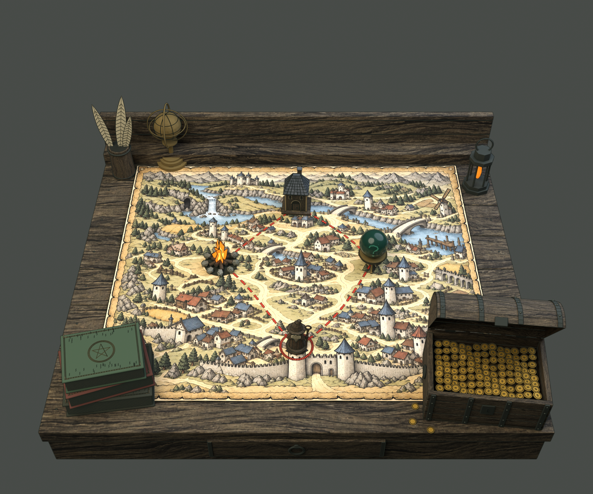
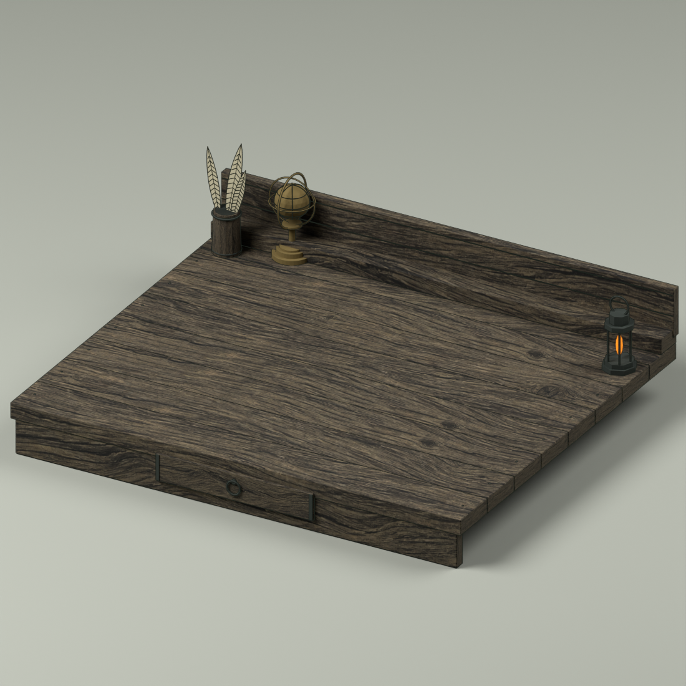
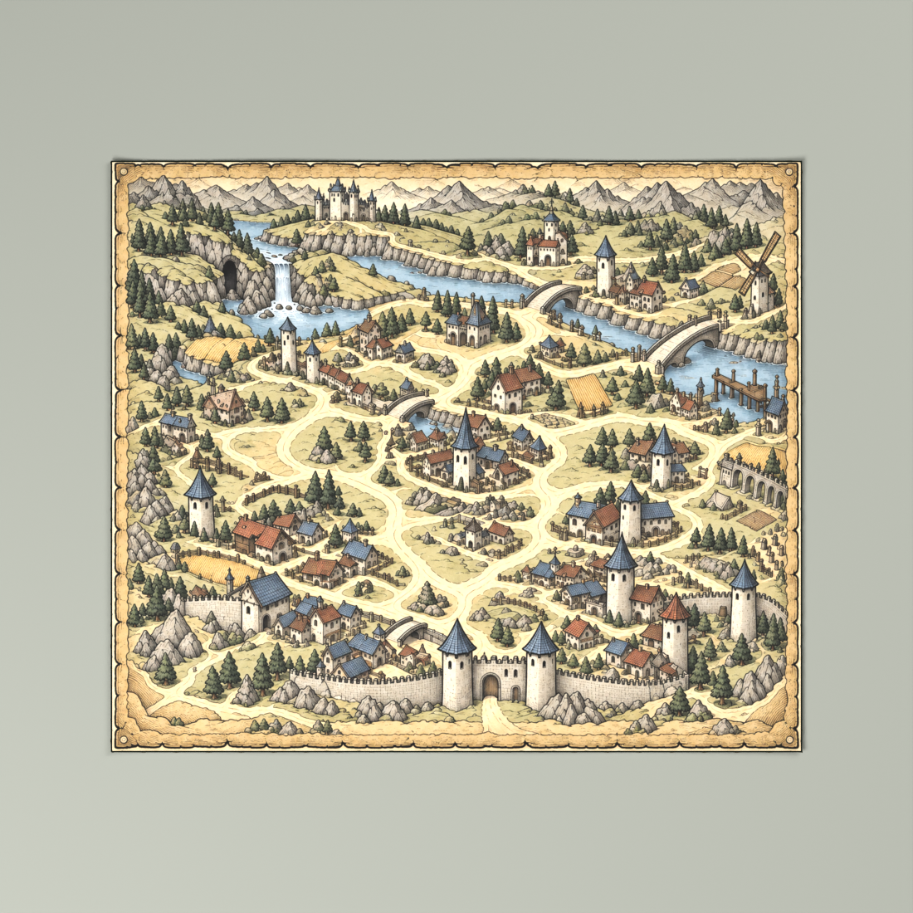
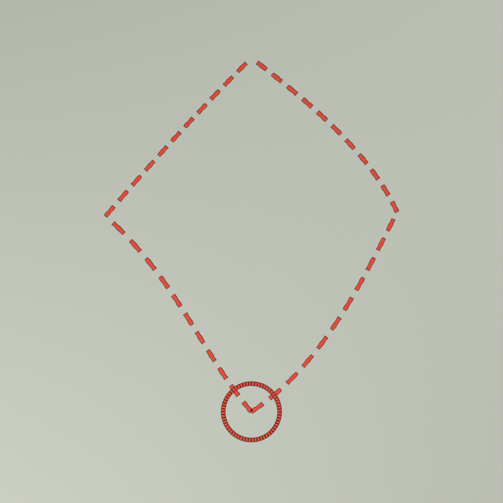
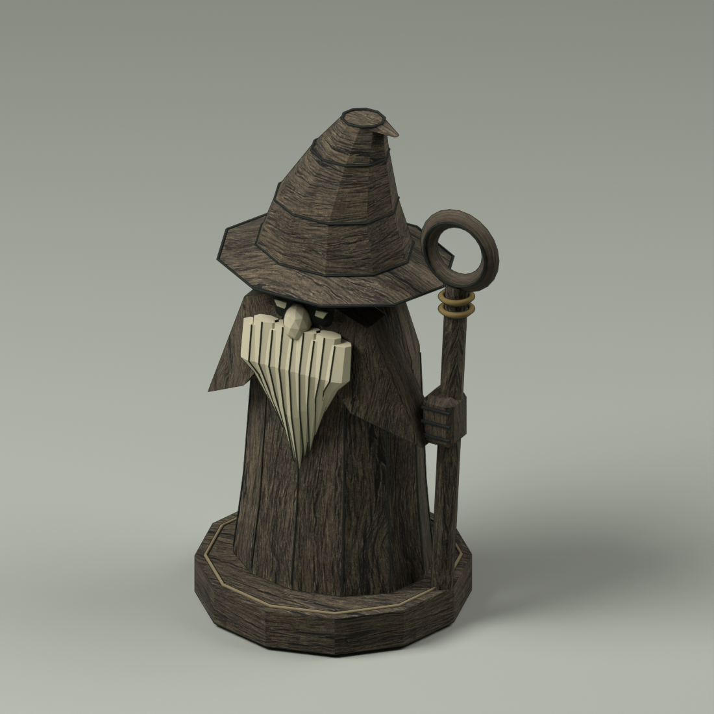
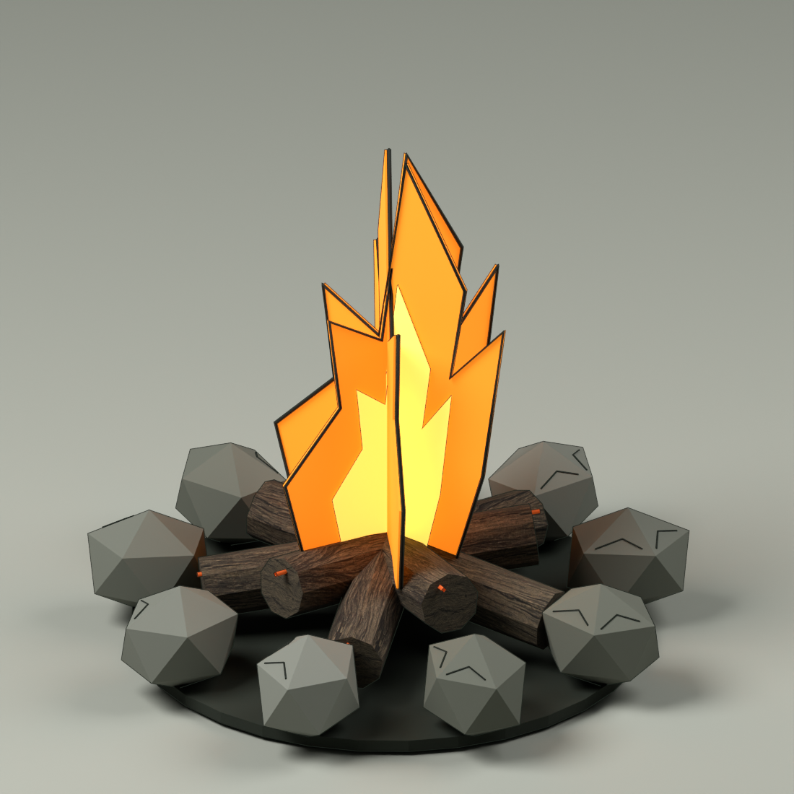
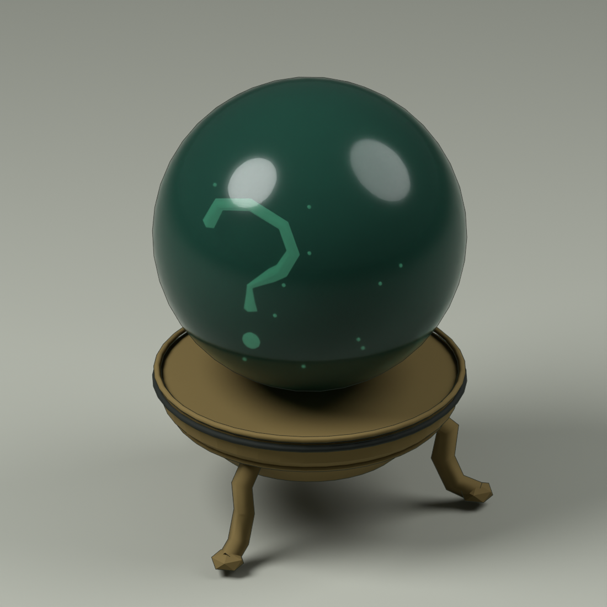
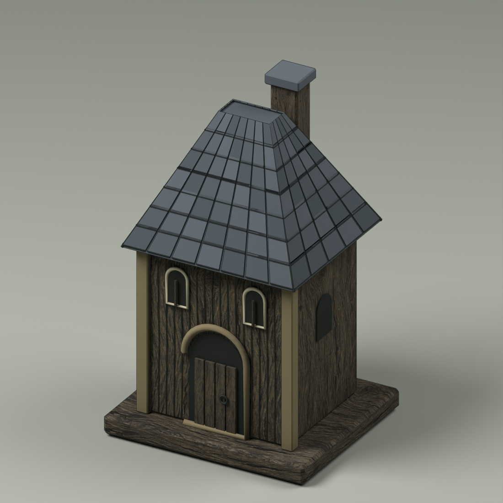
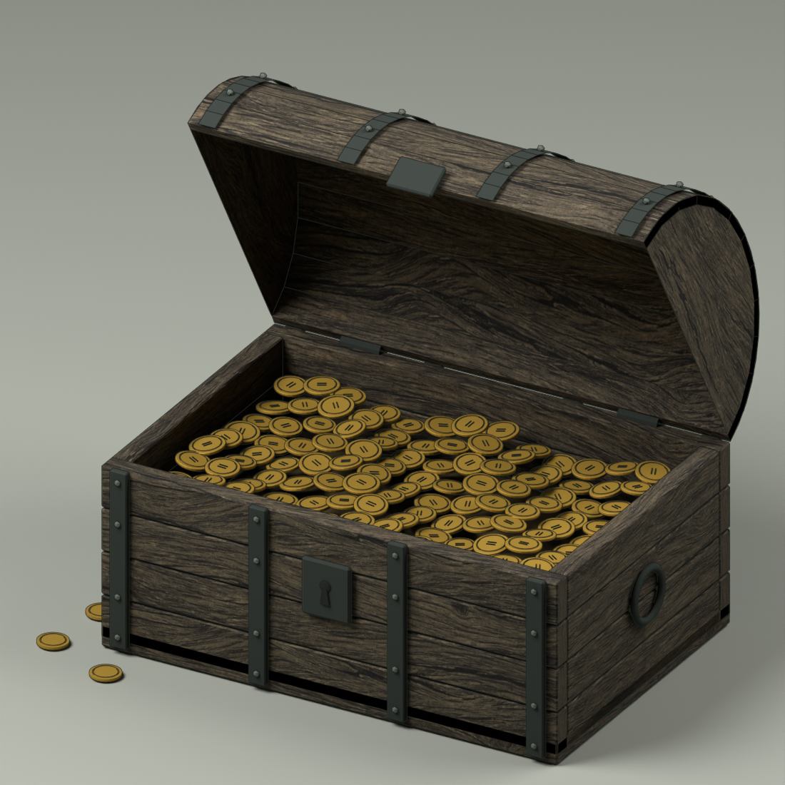
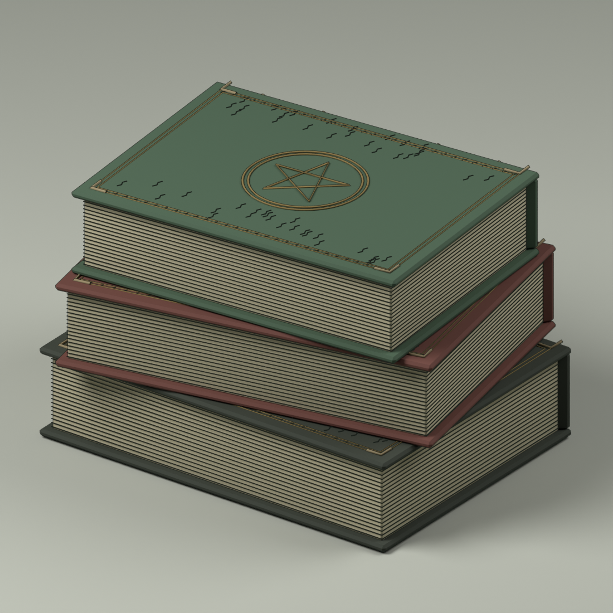

# 地图桌面 · Blender 资产图册

2026-09-13。**NativeAssetsCreated / NeedsArtReview**。本批制作九类资产，猫按用户要求暂缓；杂物保留。下方为 Blender 实际渲染。

[打开组合母版](map-desk-master.blend) · [制作／使用说明](../../docs/map-desk-assets-v01.md) · [资产清单与哈希](manifest.json) · [重新打开与回导验证](verification.json)

## 分件文件

每个 .blend 包含独立归零的资产父级、可编辑网格／曲线、已打包纹理和预览相机。展示地面及灯光不进入 GLB。GLB 内嵌其所用图像，但不携带 Blender Freestyle 描边。

| 资产 | Blender 源文件 | 交换模型 | 渲染 |
| --- | --- | --- | --- |
| MD-01 旧木桌与保留杂物 | [.blend](assets/MD-01-desk.blend) | [.glb](assets/MD-01-desk.glb) | [PNG](renders/MD-01-desk.png) |
| MD-02 环境地图与纸面 | [.blend](assets/MD-02-environment-map.blend) | [.glb](assets/MD-02-environment-map.glb) | [PNG](renders/MD-02-environment-map.png) |
| MD-03 红色路线 | [.blend](assets/MD-03-red-route.blend) | [.glb](assets/MD-03-red-route.glb) | [PNG](renders/MD-03-red-route.png) |
| MD-04 法师木雕 | [.blend](assets/MD-04-mage.blend) | [.glb](assets/MD-04-mage.glb) | [PNG](renders/MD-04-mage.png) |
| MD-05 篝火 | [.blend](assets/MD-05-campfire.blend) | [.glb](assets/MD-05-campfire.glb) | [PNG](renders/MD-05-campfire.png) |
| MD-06 水晶球 | [.blend](assets/MD-06-crystal-ball.blend) | [.glb](assets/MD-06-crystal-ball.glb) | [PNG](renders/MD-06-crystal-ball.png) |
| MD-07 地点建筑 | [.blend](assets/MD-07-building.blend) | [.glb](assets/MD-07-building.glb) | [PNG](renders/MD-07-building.png) |
| MD-08 金币宝箱 | [.blend](assets/MD-08-chest.blend) | [.glb](assets/MD-08-chest.glb) | [PNG](renders/MD-08-chest.png) |
| MD-10 旧书组合 | [.blend](assets/MD-10-books.blend) | [.glb](assets/MD-10-books.glb) | [PNG](renders/MD-10-books.png) |

在工作区运行 `./open-map-desk.ps1` 打开组合，或 `./open-map-desk.ps1 -Asset mage` 打开法师单件。可选项：master、desk、map、route、mage、campfire、orb、building、chest、books。

## MD-01 · 旧木桌与保留杂物

[编辑 Blender 源文件](assets/MD-01-desk.blend) · [查看交换模型](assets/MD-01-desk.glb)

## MD-02 · 环境地图与纸面

[编辑 Blender 源文件](assets/MD-02-environment-map.blend) · [查看交换模型](assets/MD-02-environment-map.glb)

## MD-03 · 红色路线

[编辑 Blender 源文件](assets/MD-03-red-route.blend) · [查看交换模型](assets/MD-03-red-route.glb)

## MD-04 · 法师木雕

[编辑 Blender 源文件](assets/MD-04-mage.blend) · [查看交换模型](assets/MD-04-mage.glb)

## MD-05 · 篝火

[编辑 Blender 源文件](assets/MD-05-campfire.blend) · [查看交换模型](assets/MD-05-campfire.glb)

## MD-06 · 水晶球

[编辑 Blender 源文件](assets/MD-06-crystal-ball.blend) · [查看交换模型](assets/MD-06-crystal-ball.glb)

## MD-07 · 地点建筑

[编辑 Blender 源文件](assets/MD-07-building.blend) · [查看交换模型](assets/MD-07-building.glb)

## MD-08 · 金币宝箱

[编辑 Blender 源文件](assets/MD-08-chest.blend) · [查看交换模型](assets/MD-08-chest.glb)

## MD-10 · 旧书组合

[编辑 Blender 源文件](assets/MD-10-books.blend) · [查看交换模型](assets/MD-10-books.glb)

## 编辑来源

`map-desk-generated.blend` 保留初次生成状态，`map-desk-ui.blend` 保存电脑插件实际修改后的源；`map-desk-master.blend` 是后续加工后的组合母版。宝箱的 `MD08_LID_HINGE` 本地X轴从 -48° 调整到 -60°，后续模型保留该变换。

[原生 UI 操作截图](ui-hinge-60deg.png) · [建模脚本](../build_map_desk_v01.py) · [加工／导出脚本](../publish_map_desk_v01.py) · [验证脚本](../verify_map_desk_v01.py)

当前是首轮三维资产。透明玻璃／雾气、火焰、精细雕刻与墨线仍需继续艺术加工；尚未接入新的 Godot 场景或完成性能、交互与玩法验收。
