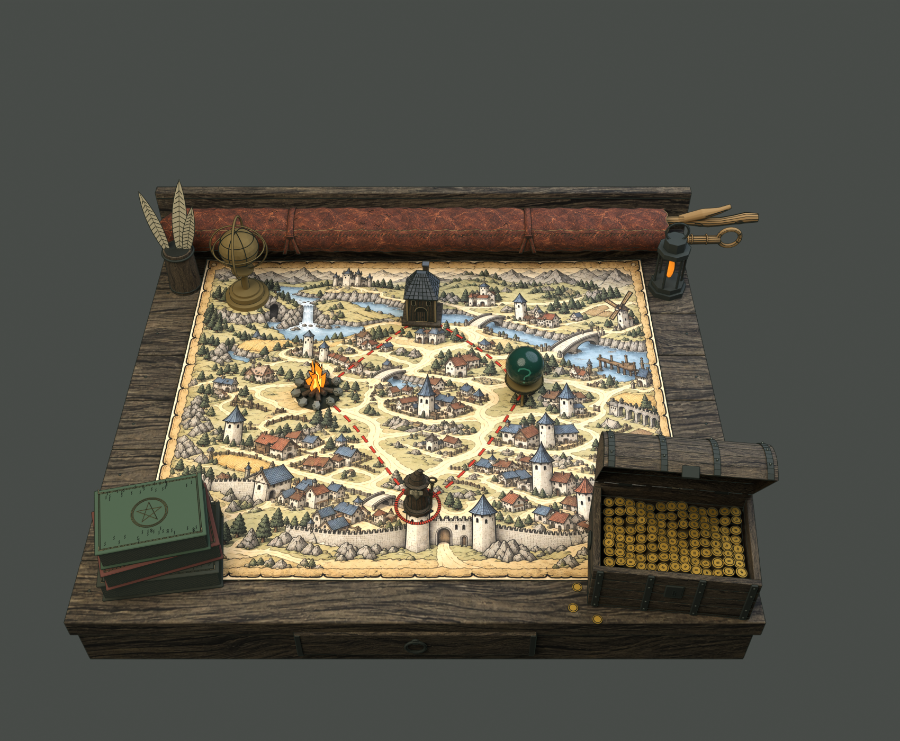

# 地图桌面 v02 · 后沿长法杖袋

2026-09-13。**NativeAssetsCreated / NeedsArtReview**。

[打开组合母版](map-desk-master.blend) · [MD-11单件与GLB](../md-11-v01/README.md) · [制作报告](../../docs/md-11-native-report.md) · [验证](../md-11-v01/verification.json)

长袋沿后侧桌沿横放，左端收口，两支长杖向右露头；猫不进入组合。保留旧版全部1,894个场景对象，仅将星仪向前移动24cm、羽毛笔组向前移动8.5cm，以便放下长袋。地图与四类节点、红线、书、灯具、金币宝箱保持原形，宝箱盖原生UI开角仍为-60°。

组合现有十个资产父级：MD-01–08、MD-10和MD-11。旧[九类分件与母版](../map-desk-v01/README.md)继续保存，旧母版SHA256未改变。此文件为新版本，没有覆盖旧模型，也未修改Godot运行场景。

`./open-map-desk.ps1` 默认打开本组合；`-Asset previous` 打开旧组合，`-Asset wand-roll` 打开长袋单件。
