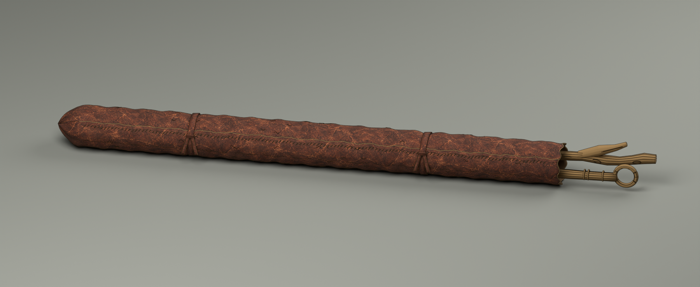
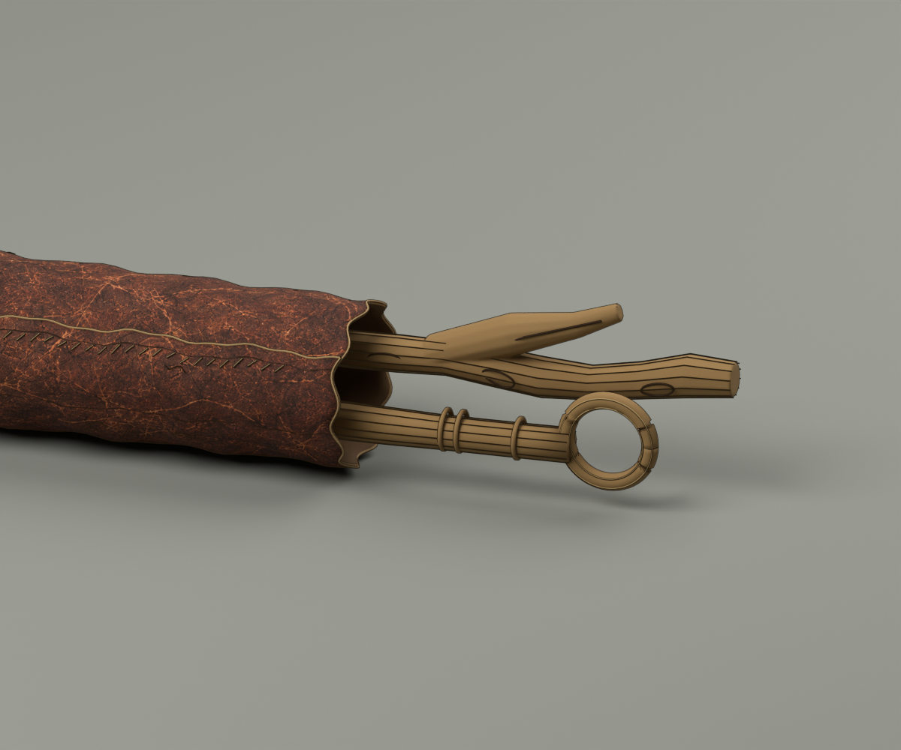
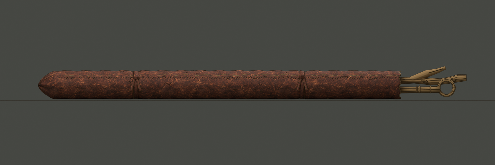

# MD-11 · 长法杖袋原生模型

2026-09-13。**NativeAssetCreated / NeedsArtReview**。用户已确认整体05和袋子设计稿，本轮按“开始建模”制作。以下图片均由交付的 Blender 模型实际渲染。

[可编辑 Blender 母版](MD-11-wand-roll.blend) · [GLB 交换模型](MD-11-wand-roll.glb) · [桌面组合 v02](../map-desk-v02/README.md) · [制作报告](../../docs/md-11-native-report.md)

袋身为一张连续网格，保留3mm厚度修改器、自由搭接边、同皮折底、破旧袋口和修补针脚。两道绑带与两支长杖可独立编辑；叉枝由连续木质网格构成，环形杖头有真实孔洞。整体约2.252×0.195×0.173米，含外露杖头；袋身约1.907米长。

在工作区运行 `./open-map-desk.ps1 -Asset wand-roll` 打开母版。资产位于 `MD-11_ASSET` 集合，`MD-11_ROOT` 局部原点为零；预览地面、相机和灯光位于独立集合，不导出进GLB。图片已内嵌，细针脚／纹线仍保留曲线，GLB使用其转换后的网格。

## 来源与验证

- [原生UI输入](md11-ui.blend)、[UI截图](ui-fork-roll-12deg.png)：实际将叉枝杖局部X角从0°改为12°，后续形体加工保留该变换。
- [生成基线](md11-generated.blend)与[交互编辑存档](md11-source.blend)留档。后续修改以发布母版或UI存档为起点，避免运行初始生成器覆盖人工编辑。
- [清单与SHA256](manifest.json)、[27项验证](verification.json)包含模型重新打开、整皮连通、实际GLB回导、尺寸／三角面一致、贴图内嵌、组合保留与画面边界。
- [皮革生成原图与提示词](../../references/md-11-native/manifest.json)用于表面颜色；模型本身由原生网格／曲线构造。首次渲染留在[first-pass.png](renders/first-pass.png)，当前以hero为准。

这是可继续雕刻与评议的首版模型。当前GLB有331,584个三角面，尚未做运行时减面／LOD；Blender Freestyle外轮廓不随GLB导出。细排线、皮革搭接厚重感与木节雕刻仍可继续接近设计稿，本次不认定美术已经最终验收。
