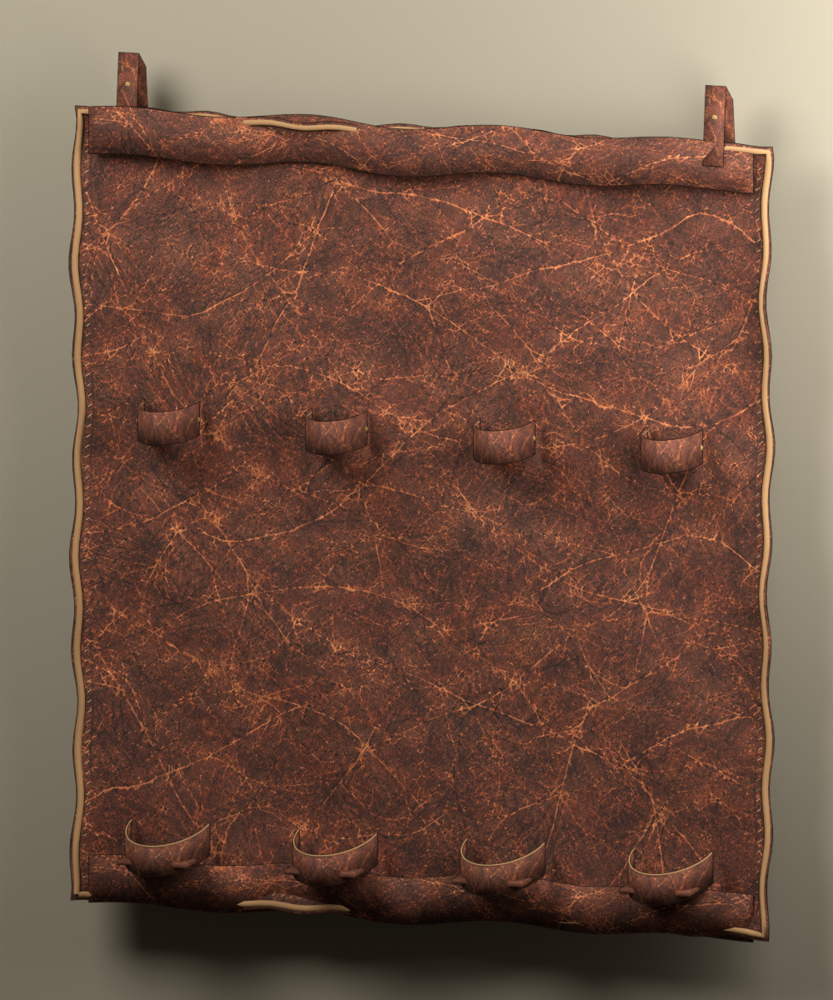
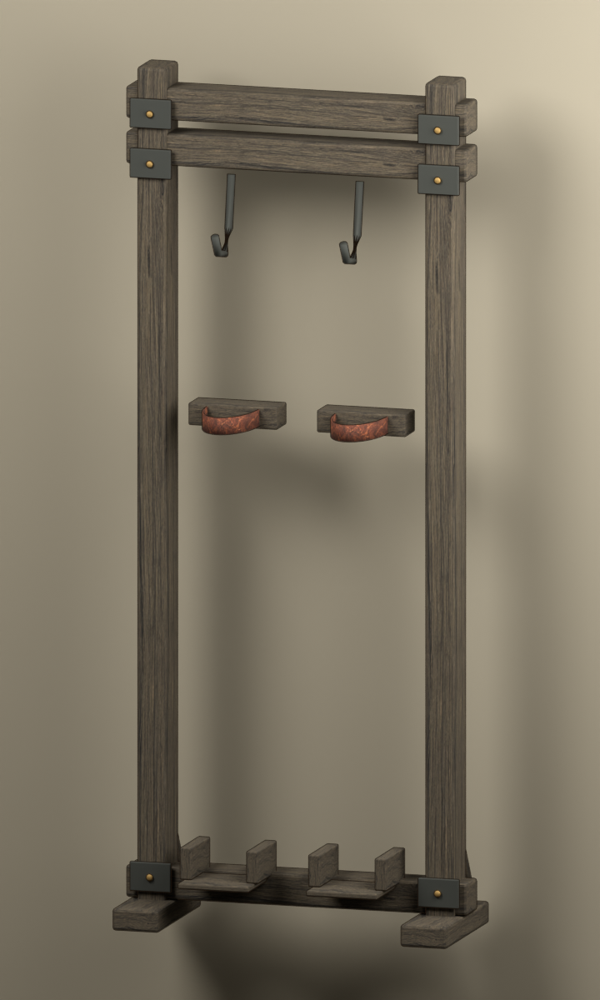
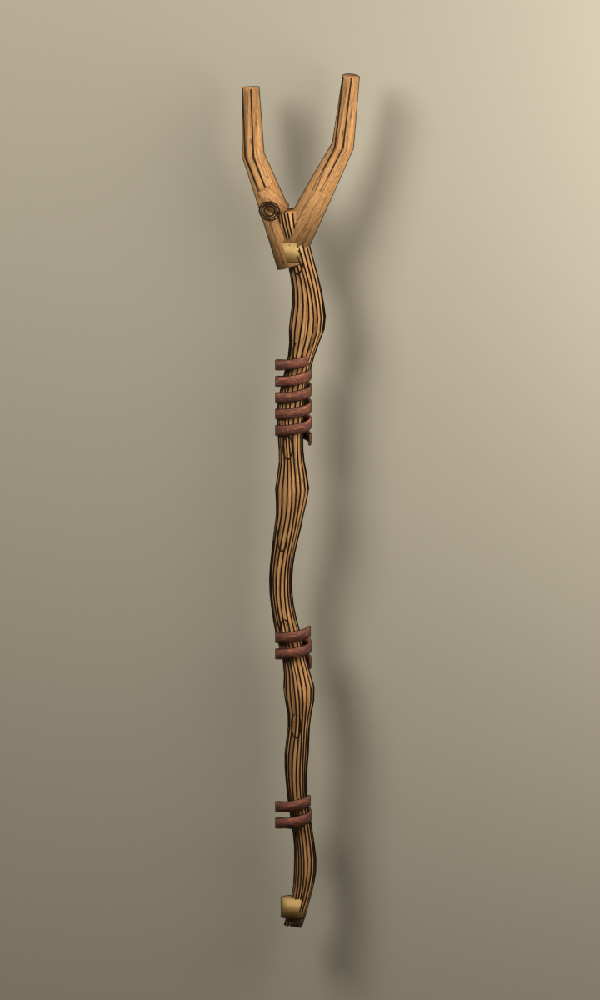
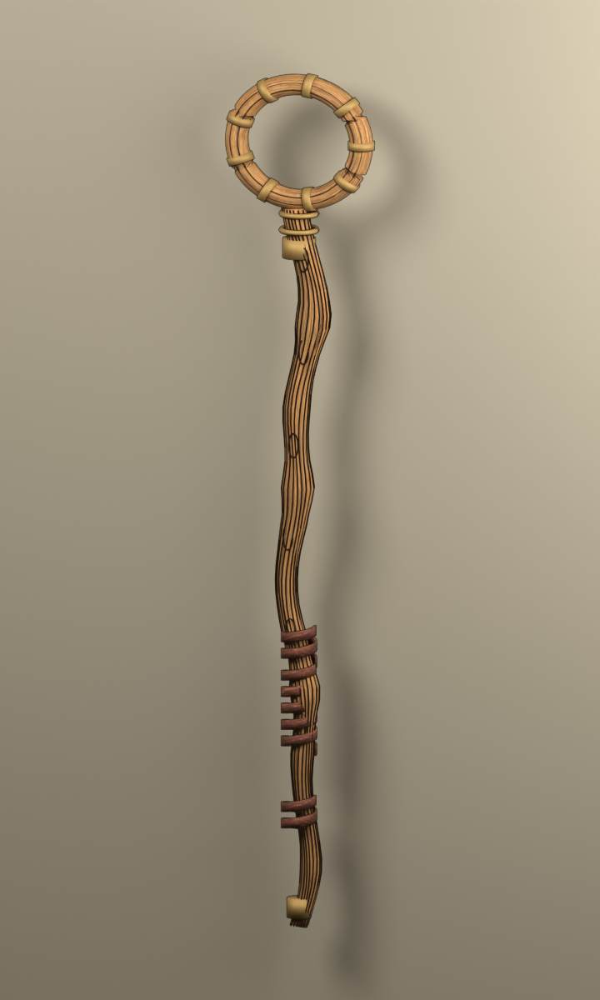
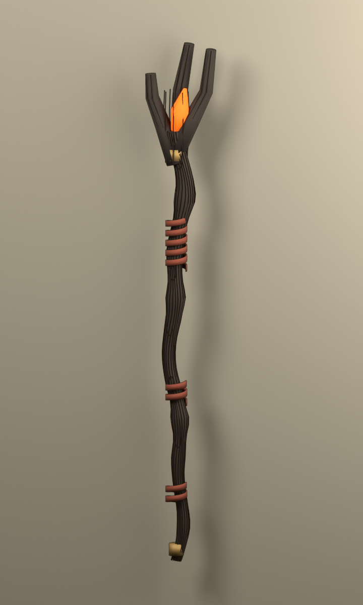
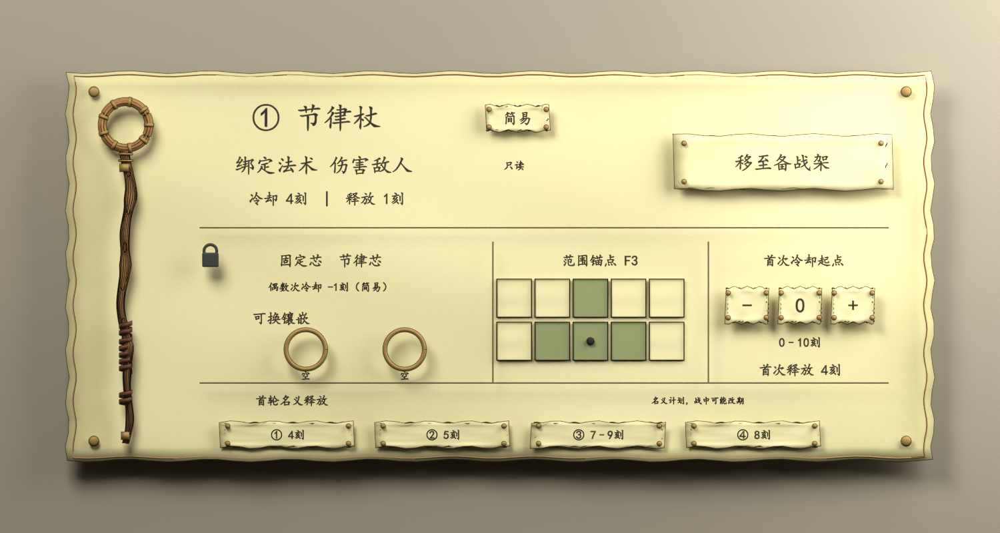
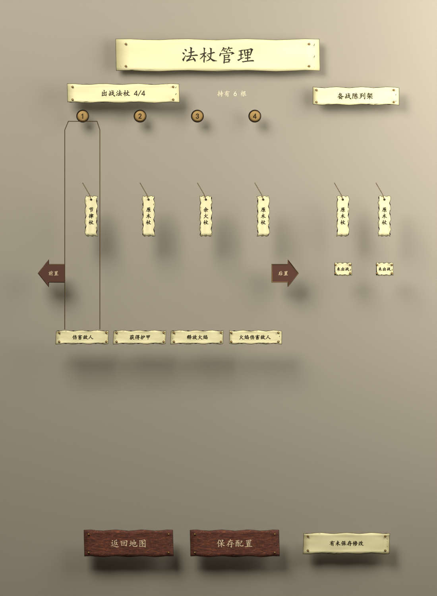

# 法杖管理 · 原生 Blender 资产 v01

2026-09-14。**NativeAssetsCreated / NeedsArtReview**。依据用户已通过的[整体03](../../concepts/wand-management-overall-v03.png)、[七组组件稿](../../concepts/wand-management-sheets-v01/index.md)及“开始建模”制作。这里展示实际 Blender 渲染。

[打开组合母版](wand-management-master.blend) · [组合 GLB](wand-management-assembly.glb) · [制作报告](../../docs/wand-management-native-report.md) · [文件清单与哈希](manifest.json) · [结构与回导检查](verification.json) · [交付文件检查](delivery-checks.json)


袋中四根出战杖，独立木架上两根备用杖；总数六根是示例。配置纸面显示只读法术、锁定固定芯、两个可换空槽、F3范围与首轮名义时间。书、灯和羽毛笔保留。

## 七组独立源文件

| 编号 | 原生源 | 交换文件 | 结构 |
| --- | --- | --- | --- |
| WM-01 | [展开皮袋](assets/WM-01-deployed-leather.blend) | [GLB](assets/WM-01-deployed-leather.glb) | 连续皮面、卷边、四固定环、四杖尾托位、悬挂带与缝线 |
| WM-02 | [备战架](assets/WM-02-reserve-rack.blend) | [GLB](assets/WM-02-reserve-rack.glb) | 开放背部、独立柱梁、挂钩、固定带与底座 |
| WM-03 | [原木杖](assets/WM-03-raw-wood-staff.blend) | [GLB](assets/WM-03-raw-wood-staff.glb) | 天然叉枝、弯曲木杆、木节、缠皮与尾箍 |
| WM-04 | [节律杖](assets/WM-04-rhythm-staff.blend) | [GLB](assets/WM-04-rhythm-staff.glb) | 有空洞的木环、铜箍、杆身、握柄与尾箍 |
| WM-05 | [余火杖](assets/WM-05-ember-staff.blend) | [GLB](assets/WM-05-ember-staff.glb) | 焦木叉头、局部余烬、木杆与缠皮 |
| WM-06 | [配置羊皮纸](assets/WM-06-configuration-parchment.blend) | [GLB](assets/WM-06-configuration-parchment.glb) | 纸面、钉、槽框、十格范围、24个可编辑文字对象 |
| WM-07 | [吊牌与操作件](assets/WM-07-tags-and-controls.blend) | [GLB](assets/WM-07-tags-and-controls.glb) | 标题、编号、六吊签、排序、保存／返回与25个可编辑文字对象 |

独立文件的根对象位于原点。组件自带预览镜头、灯和背景板，导出 GLB 时排除展示设施。WM-07 按组合页位置拆出，图中留白是配置纸面原本占用的空间。









## 打开与继续编辑

在实验仓库根目录运行：

```powershell
.\open-wand-management.ps1
.\open-wand-management.ps1 -Asset rhythm
```

可选组件名为 assembly、leather、rack、raw、rhythm、ember、parchment、controls。主文件是后续编辑来源；各组通过根空对象移动。网格、皮面厚度修改器、木纹／缝线曲线和文字仍可编辑，材质图片与中文字体已打包。

[初始生成器](../build_wand_management.py)只用于有意从头重建；已有母版时默认拒绝覆盖，需要显式 `-- --rebuild`。后续人工修改应直接保存母版，再用[发布脚本](../publish_wand_management.py)的 `-- --republish` 重出分件和交换文件；不要用初始生成器覆盖人工改动。[验证脚本](../verify_wand_management.py)检查独立重开、回导、数量、取景及历史文件保留。

运行脚本时先加载 `tools/env.ps1`，使用 `$BlenderExe -b --factory-startup --python-exit-code 1 --python <脚本路径>`，所需覆盖参数放在脚本路径之后。

当前只交付静态美术资产。GLB中文字会转为固定网格，进入游戏时还需动态 UI 文字；描边是 Blender Freestyle 效果。481,414个总装三角形尚未做运行时优化，Godot接入与管理操作均未实施。[首轮历史渲染](renders/assembly-first-pass.png)保留用于比较，不作为当前成品图。
