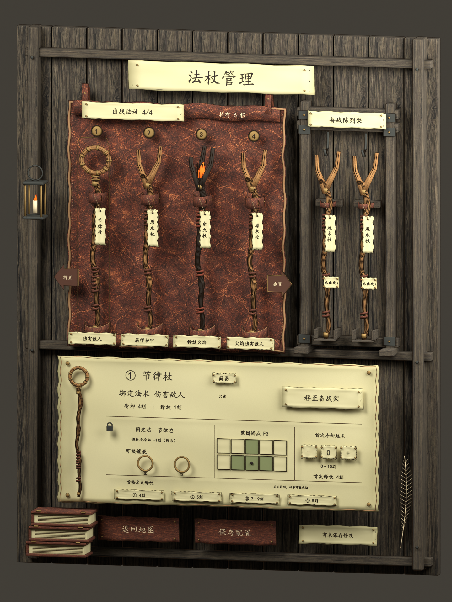
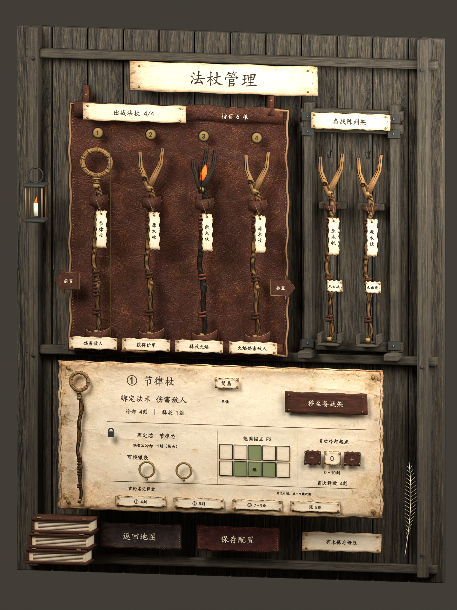
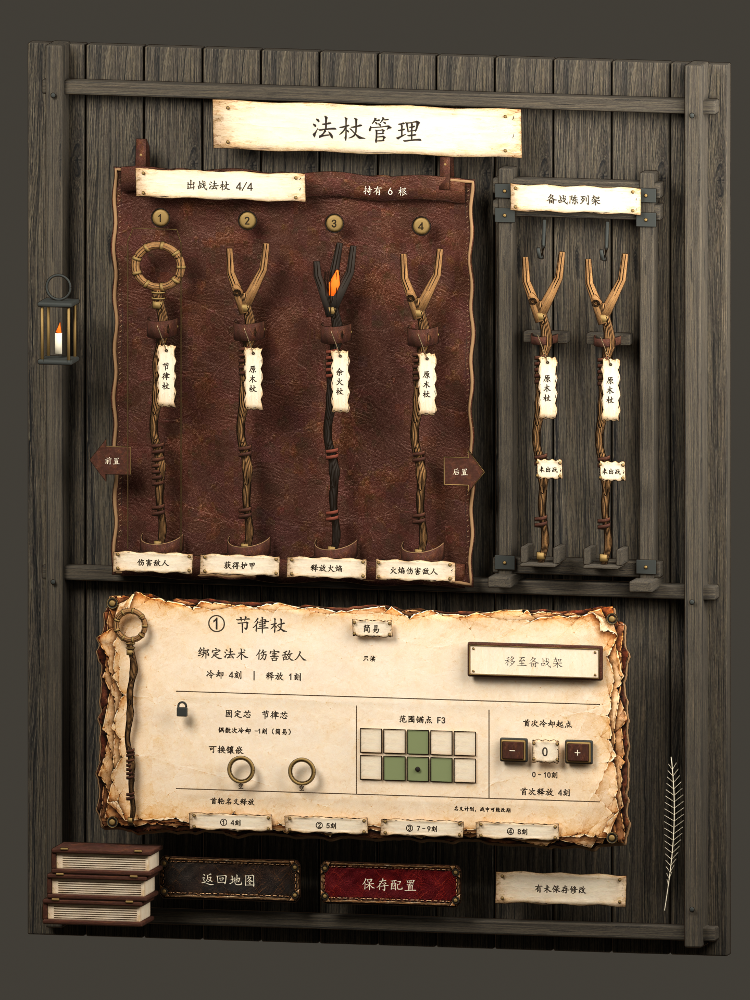
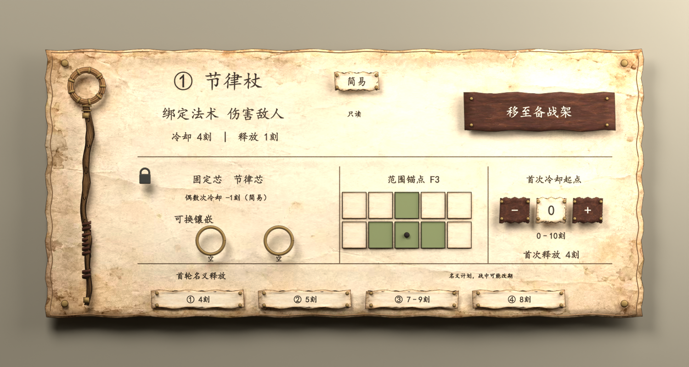
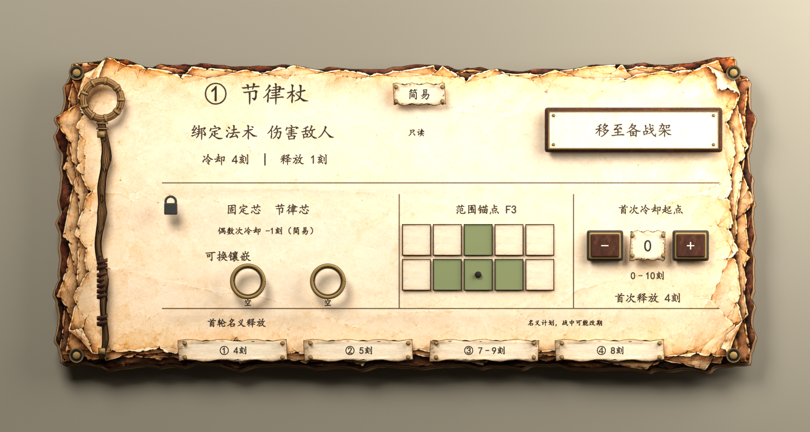
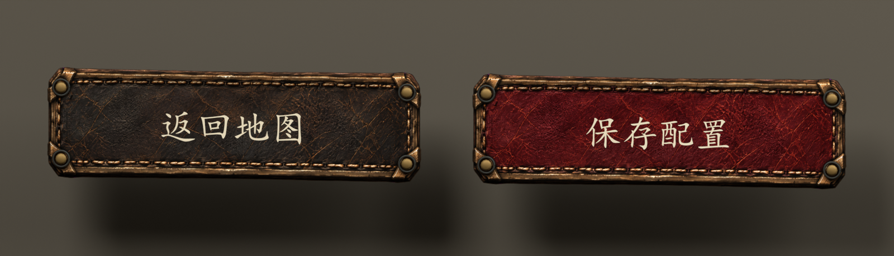

# 实际渲染对照

三版使用同一总装斜视设置。点击图片可查看原始分辨率。v01是原生首版，v02是上一轮用户贴图版，v03是本轮实体面板优化。生成稿不列入这个实际渲染对照。

| v01 原生首版 | v02 贴图接入 | v03 实体面板 |
| --- | --- | --- |
|  |  |  |

| v02 旧面板 | v03 新面板 |
| --- | --- |
|  |  |

[完整复查结论](quality-review.md) · [原生模型与GLB](README.md)
