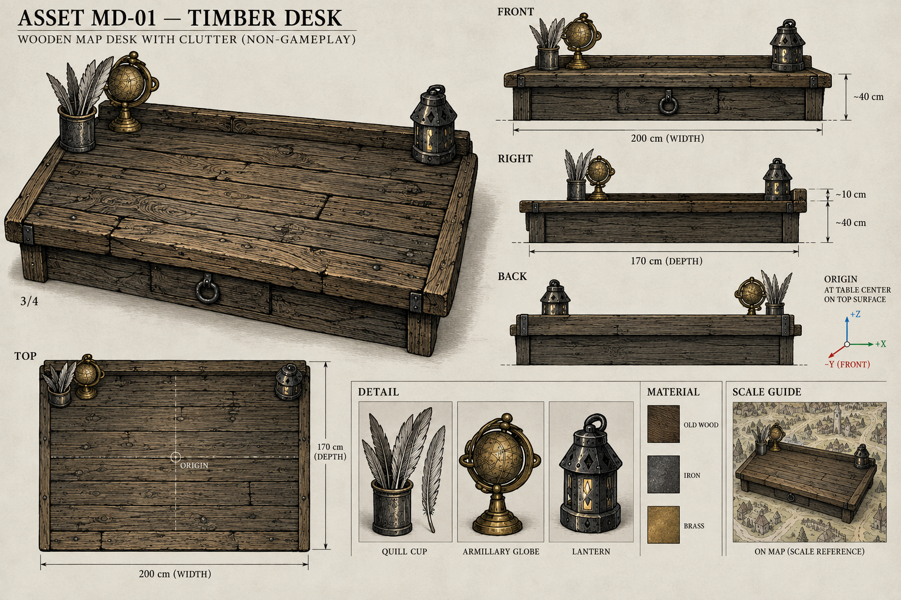
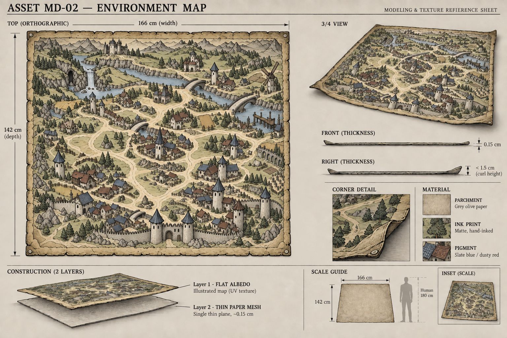
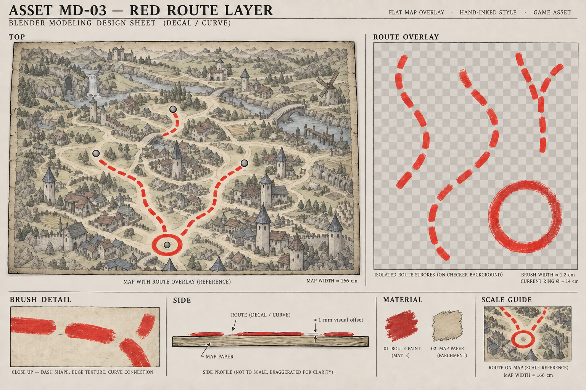
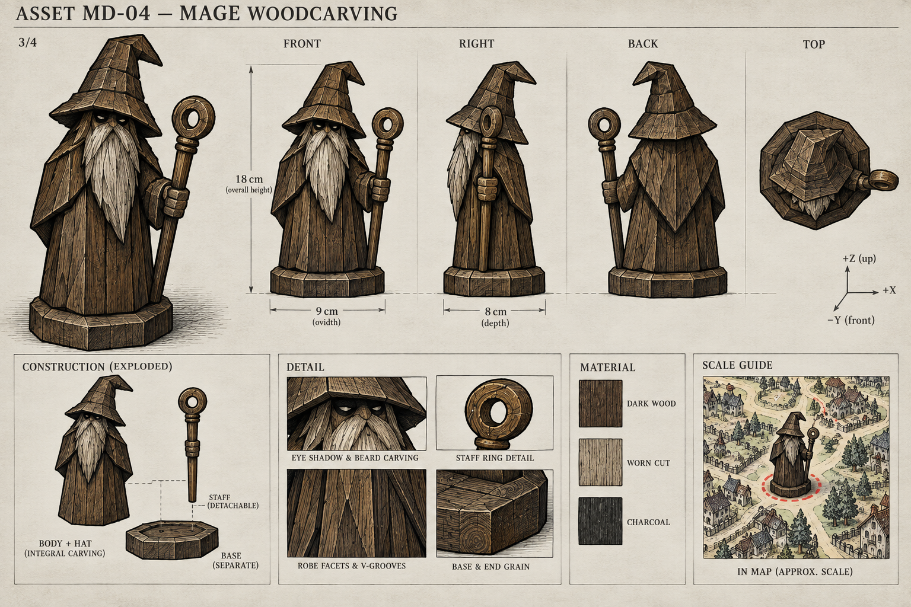
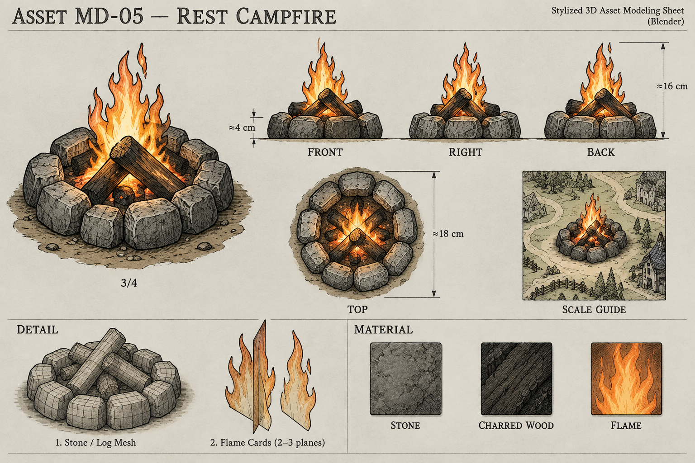
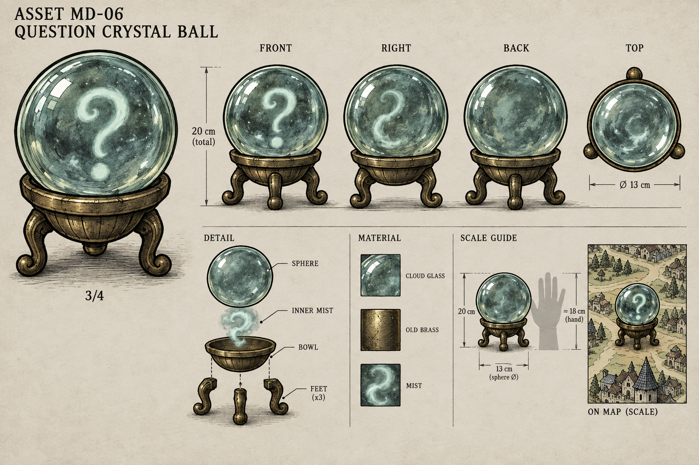
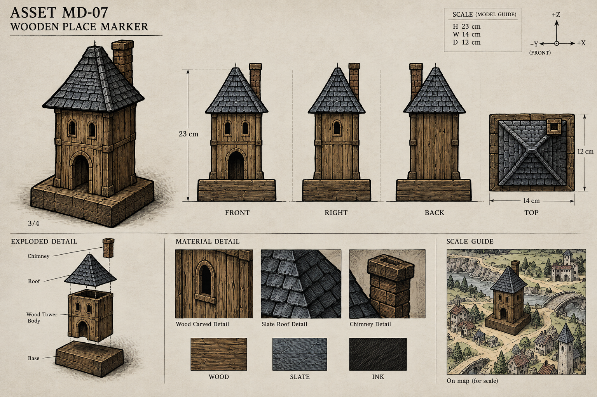
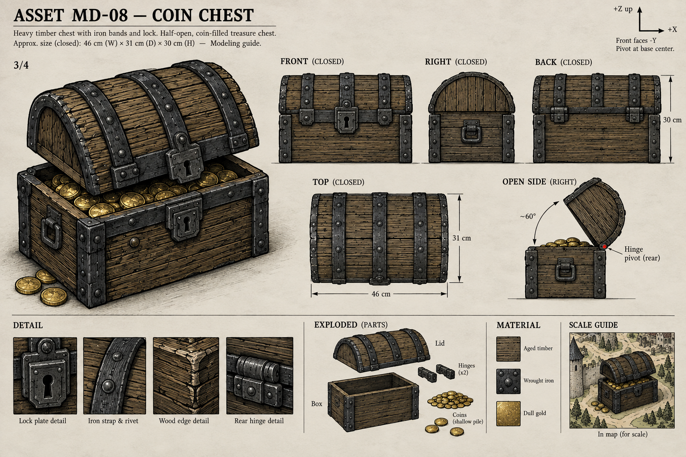
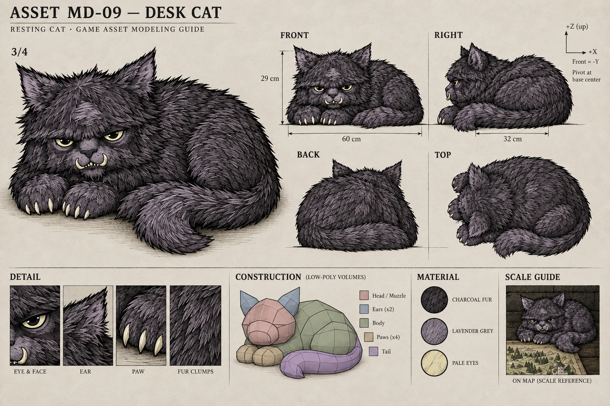
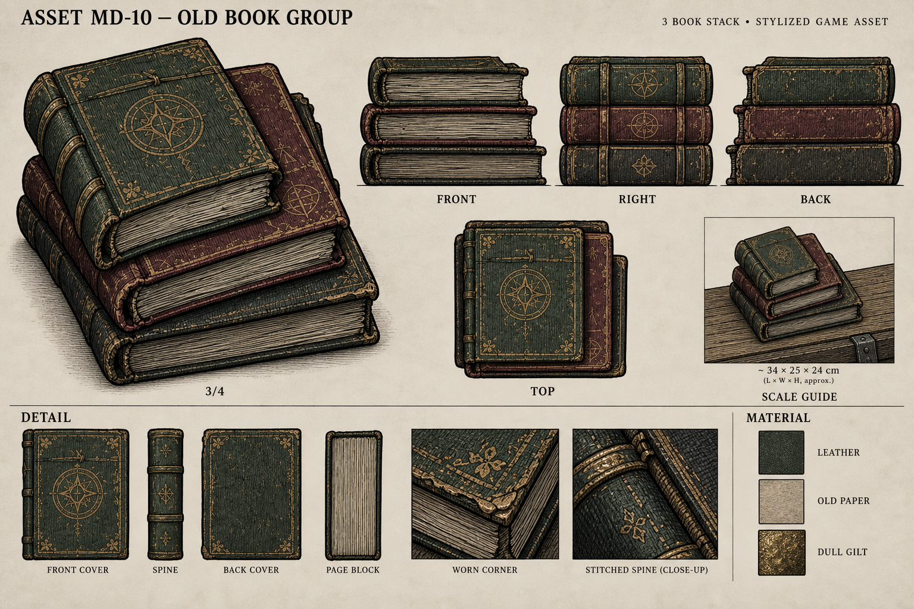

# 地图桌面 · Blender 分件设计图册 01

2026-09-13。整体方向已获用户确认；本册为 **10 张组件建模设计稿**。统一参考[已确认整体图](../map-desk-overall-v02.png)，保留羽毛笔／笔筒、天球仪和边缘灯具。

[中文建模说明](../../docs/blender-component-design-v01.md) · [整体视觉文稿](../../docs/map-desk-visual-design-v02.md) · [来源与 SHA256 清单](manifest.json)

实体组件提供主效果、正／侧／背／顶方向与拆件细节；地图和红线使用顶视、分层与厚度示意。所有选用图均为 1536 × 1024。生成视图存在局部透视／方位偏差，尺寸和校准说明以中文文稿为准；本册不是已完成的 Blender 模型。

| 编号 | 设计稿 | 建模尺度建议 |
| --- | --- | --- |
| MD-01 | [旧木桌与保留杂物](md-01-desk-v01.png) | 200 × 170 cm；桌板厚 7 cm |
| MD-02 | [环境地图与纸面](md-02-environment-map-v02.png) | 166 × 142 cm；纸边厚 0.15 cm |
| MD-03 | [红色路线独立层](md-03-red-route-v02.png) | 与地图同一 UV 坐标；笔迹宽约 1.2 cm |
| MD-04 | [玩家法师木雕](md-04-mage-woodcarving-v01.png) | 高 18 cm；底座约 9 × 8 cm |
| MD-05 | [休息篝火](md-05-campfire-v01.png) | 石环直径 18 cm；含火焰高约 16 cm |
| MD-06 | [问号事件水晶球](md-06-crystal-ball-v01.png) | 总高 20 cm；球径 13 cm |
| MD-07 | [地点简易建筑](md-07-place-building-v01.png) | 高 23 cm；底座 14 × 12 cm |
| MD-08 | [金币宝箱](md-08-coin-chest-v01.png) | 宽 46 × 深 31 × 闭合高 30 cm |
| MD-09 | [桌角猫](md-09-cat-v01.png) | 卧姿长 60 × 宽 32 × 高 29 cm |
| MD-10 | [旧书组合](md-10-books-v01.png) | 最大一本 34 × 25 × 厚 8 cm |

## MD-01 · 旧木桌与保留杂物

SCALE GUIDE 中的地图垫底不是摆放依据；纸应铺在桌面上。侧视是造型辅助，建模时校准后沿及装饰位置。7 cm 指桌板厚度。

[原图](md-01-desk-v01.png) · [初始提示词](md-01-desk-v01-prompt.md)

## MD-02 · 环境地图与纸面

选用修订版：主图为矩形顶视，移除实体摆件和红线。仍是含版式的参考稿，尚非可直接铺满 UV 的贴图。

[原图](md-02-environment-map-v02.png) · [初始提示词](md-02-environment-map-v01-prompt.md) · [修订提示词](md-02-environment-map-v02-prompt.md)

## MD-03 · 红色路线独立层

选用修订版：实体摆件已改为中性定位点。棋盘格是画出的透明示意，并非 PNG 透明通道；底图与 MD-02 尚未逐像素配准。

[原图](md-03-red-route-v02.png) · [初始提示词](md-03-red-route-v01-prompt.md) · [修订提示词](md-03-red-route-v02-prompt.md)

## MD-04 · 玩家法师木雕

RIGHT 仍带斜角，非严格正交投影。以 FRONT 的持杖侧、3/4 的剪影为造型依据，白模阶段统一帽尖、手杖和底座的位置。

[原图](md-04-mage-woodcarving-v01.png) · [初始提示词](md-04-mage-woodcarving-v01-prompt.md)

## MD-05 · 休息篝火

火焰各视图仅表达轮廓方向；石块数量与排布须在同一模型中固定，不将不同视图当不同方案拼接。

[原图](md-05-campfire-v01.png) · [初始提示词](md-05-campfire-v01-prompt.md)

## MD-06 · 问号事件水晶球

球内问号在侧视中仍偏向观者；建议作为面向主镜头的内部雾片处理。玻璃外观尚未经过 Blender/Godot 着色验证。

[原图](md-06-crystal-ball-v01.png) · [初始提示词](md-06-crystal-ball-v01-prompt.md)

## MD-07 · 地点简易建筑

建筑细部和屋瓦属于建模参考；以主视图固定门窗、烟囱方位，再由模型生成一致视图。

[原图](md-07-place-building-v01.png) · [初始提示词](md-07-place-building-v01-prompt.md)

## MD-08 · 金币宝箱

闭合四视图作为结构基准，半开效果与 OPEN SIDE 为开启姿态参考。SCALE GUIDE 不决定摆放；宝箱应位于右下桌边。

[原图](md-08-coin-chest-v01.png) · [初始提示词](md-08-coin-chest-v01-prompt.md)

## MD-09 · 桌角猫

四视图固定伏卧意图；毛束遮蔽的肢体结构待白模校准，不由排线推断额外爪子。

[原图](md-09-cat-v01.png) · [初始提示词](md-09-cat-v01-prompt.md)

## MD-10 · 旧书组合

34 × 25 × 8 cm 指最大单本；约 24 cm 指整叠高度。页块为实体，密集纸页线使用贴图。

[原图](md-10-books-v01.png) · [初始提示词](md-10-books-v01-prompt.md)

## 版本说明

MD-02、MD-03 当前选用 v02；两张 v01 保留为修订来源，不进入本册当前清单。图像模型原始输出、12 份提示词与来源哈希均已归档。整体布局的摆放以已确认整体图为准，组件稿的小角标仅供材质／尺度阅读。

