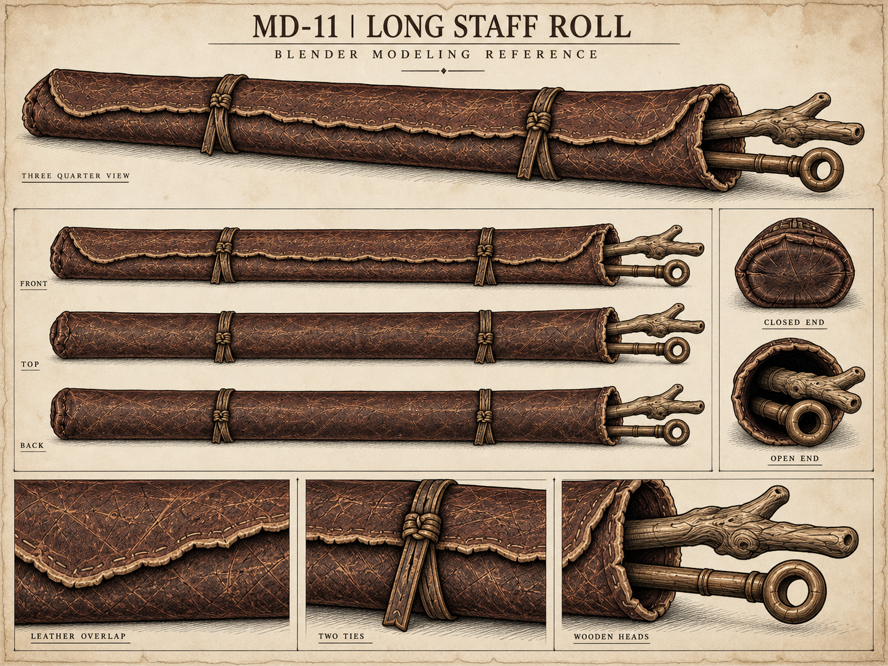
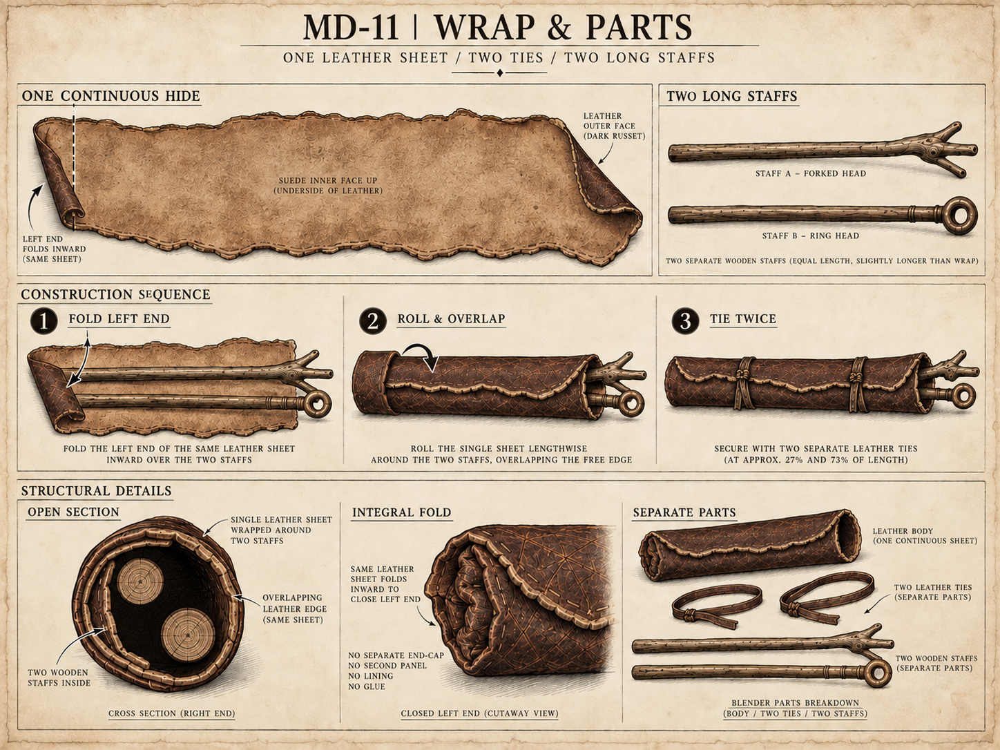

# MD-11 · 长法杖袋设计图册

2026-09-13。**OverallDirectionConfirmed / ComponentDesignDraft**。用户已确认[整体图05](../map-desk-overall-v05.png)，法杖袋替代猫在桌面后侧的位置。

[中文建模说明](../../docs/blender-wand-roll-design-v01.md) · [来源与提示词清单](manifest.json) · [此前十张历史组件稿](../blender-sheets-v01/index.md)

## 外观与多视图

[原图](md-11-wand-roll-appearance-v01.png) · [提示词](md-11-wand-roll-appearance-v01-prompt.md)

主效果、正／顶／背方向参考、闭端与袋口、皮革搭接、绑带和杖头细节。形体比例以主效果和整体图05为准，各方向图须由后续同一模型重新对齐。

## 整皮包卷与拆件

[当前原图](md-11-wand-roll-construction-v02.png) · [初始提示词](md-11-wand-roll-construction-v01-prompt.md) · [剖面修订提示词](md-11-wand-roll-construction-v02-prompt.md) · [修订前图](md-11-wand-roll-construction-v01.png)

展开整皮、同皮折底、包卷顺序、两道绑带、两个实心木杆剖面与独立部件。各面板是结构示意，不按统一比例绘制；过程图中较短的袋体不覆盖主外观的长法杖尺度。

本册选用两张1448×1086图，另保留一张修订前图，均为内置imagegen位图设计稿。没有新的Blender模型或运行材质；纸底、标题和标注不能当作资产贴图。MD-09猫退出当前构图，历史设计图保留，其他已有组件继续使用。
