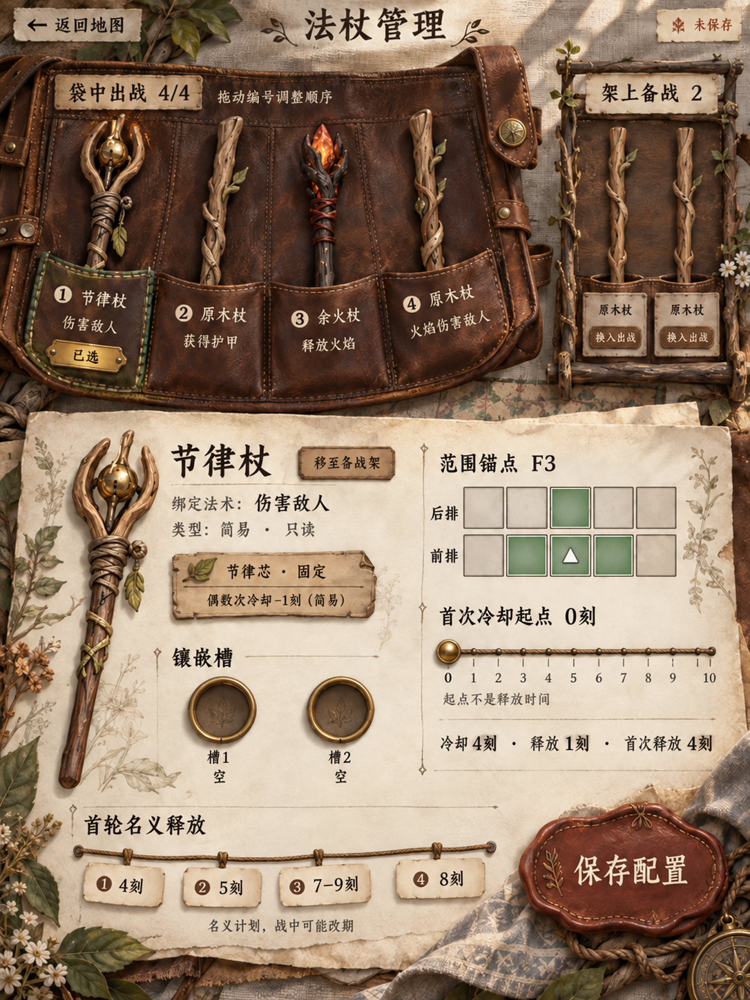
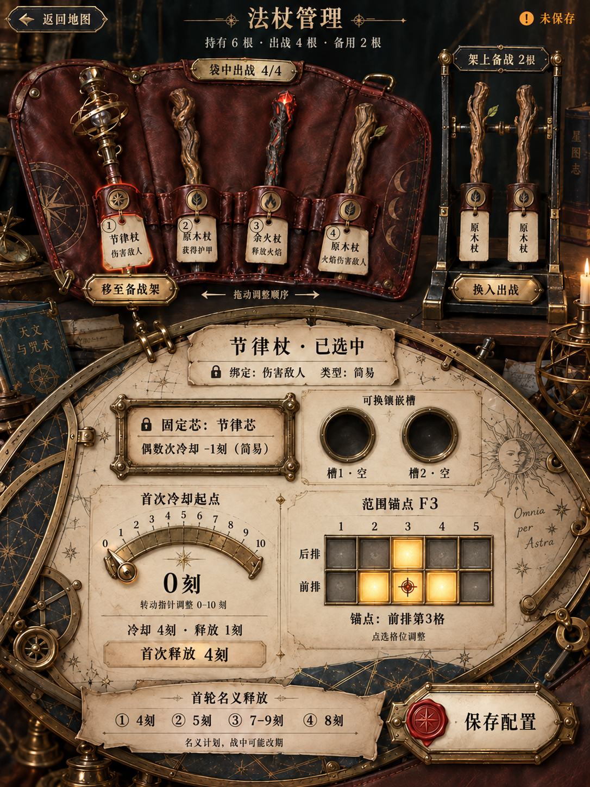
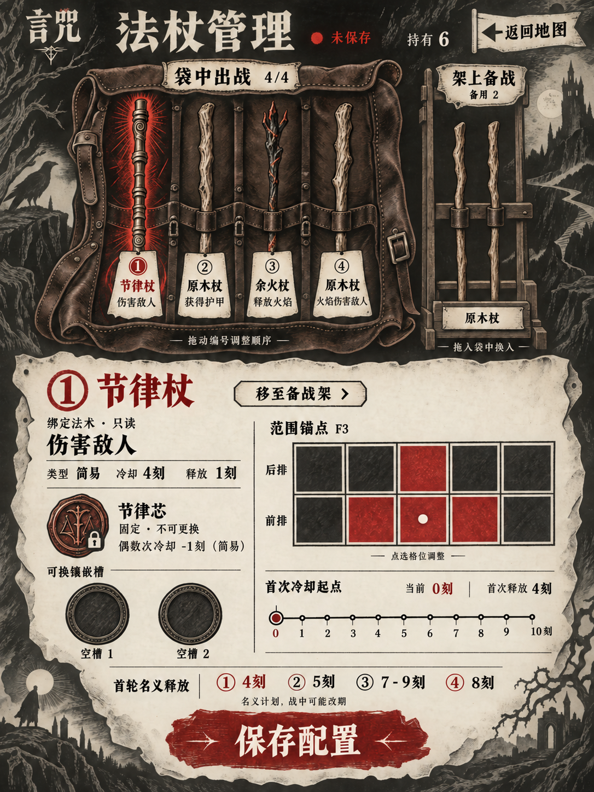

# 法杖管理 · 三名 agent 独立设计探索

2026-09-19。**VisualExplorationDraft / NeedsReview**。按用户要求，仅将功能与风格背景交给三个未继承旧对话的 agent。各自写设计说明、亲自调用内置 image_gen，再检查自己的输出。[公共功能简报](brief.md)与[独立设计方法](process.md)可供审阅。

这些是新绘制的概念页面，尚未选定方向；不是 Blender 渲染，也没有接入游戏。现有 v03 模型保留。[主 agent 对比复查](comparison.md)明确记录三版的差异与仍然相似的布局结构。

## 1 · 旅途手作：林野行装册

[设计说明](fieldcraft/design.md) · [提示词](fieldcraft/prompt.md) · [实图检查](fieldcraft/visual-review.md) · [来源](fieldcraft/provenance.json)

## 2 · 黄铜天文仪器：星盘行囊

[设计说明](observatory/design.md) · [提示词](observatory/prompt.md) · [实图检查](observatory/visual-review.md) · [来源](observatory/provenance.json)

## 3 · 民俗暗黑木刻

[设计说明](woodcut/design.md) · [初始提示词](woodcut/prompt-initial.md) · [修正提示词](woodcut/refinement-prompt.md) · [实图检查](woodcut/visual-review.md) · [来源](woodcut/provenance.json)

每张图保持四出战／两备用、只读法术、两镶嵌槽等功能背景，各设计者自主决定具体布局和物件形态。初次生成均未传旧页面图片；修订只使用设计者自己的初稿。独立agent不等于不同基础模型，本批都使用当前可用的内置生图服务。

生成小字、命中区、动态反馈、键盘操作和游戏内缩放尚未验收。最终以各自实图检查记录的可见结果为准，不把提示词中“要求有”的内容直接当成已呈现。
