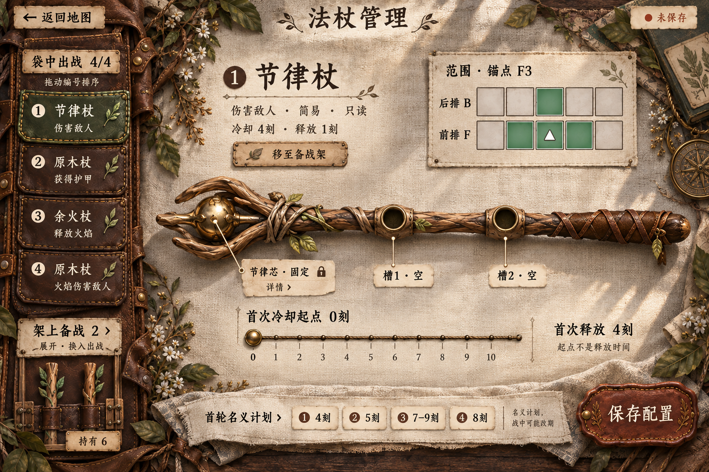
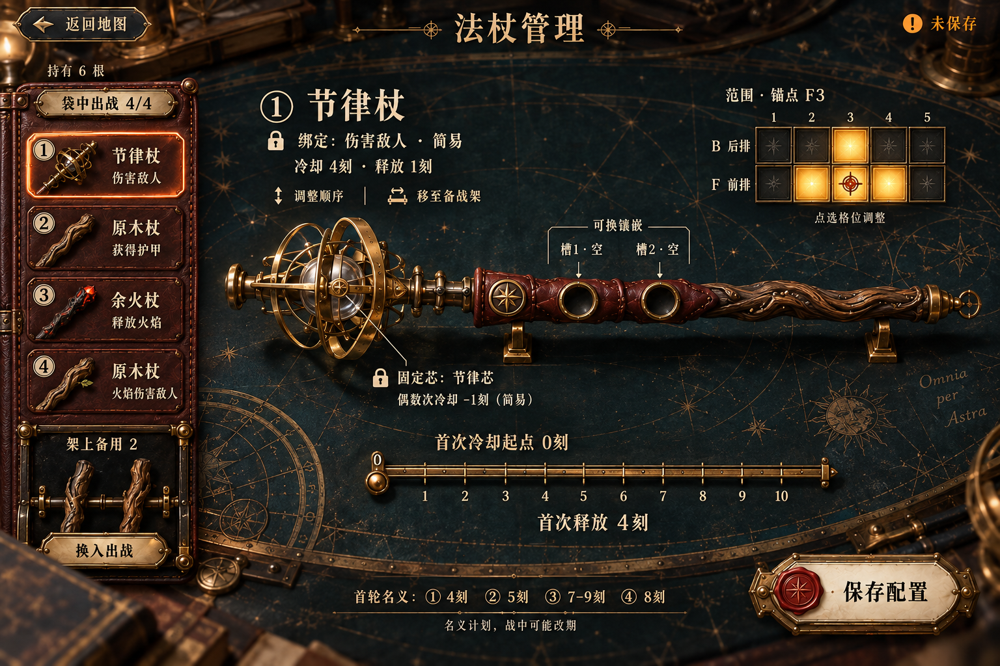
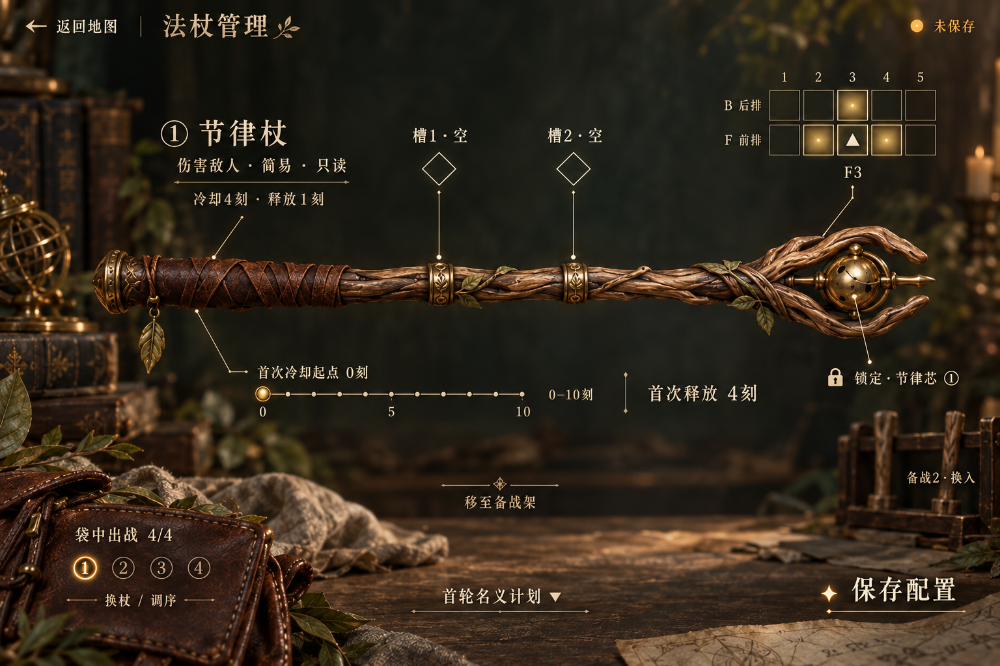

# 法杖管理 · 放开布局与悬浮投影探索

2026-09-19。**VisualExplorationDraft / NeedsReview**。保留上一轮自然手作、黄铜仪器的风格背景，并增加用户指定的悬浮投影。三名agent独立设计与生图，分别保留设计说明、提示词、生成来源和实际图像审查。

[本轮功能与简化范围](brief.md) · [独立设计方法](process.md) · [三版效果复查](comparison.md)

## 1 · 自然手作

[设计说明](fieldcraft/design.md) · [提示词](fieldcraft/prompt.md) · [实图检查](fieldcraft/visual-review.md) · [来源](fieldcraft/provenance.json)

## 2 · 黄铜仪器

[设计说明](observatory/design.md) · [提示词](observatory/prompt.md) · [实图检查](observatory/visual-review.md) · [来源](observatory/provenance.json)

## 3 · 悬浮投影

[设计说明](projection/design.md) · [提示词](projection/prompt.md) · [实图检查](projection/visual-review.md) · [来源](projection/provenance.json)

效果图展示当前选择与配置意图，不代表控件、投影、拖动、字体或游戏逻辑已实现。功能信息的折叠是呈现策略，不改变既有功能与数值。当前原生资产仍是v03，未因新效果图覆盖模型。
