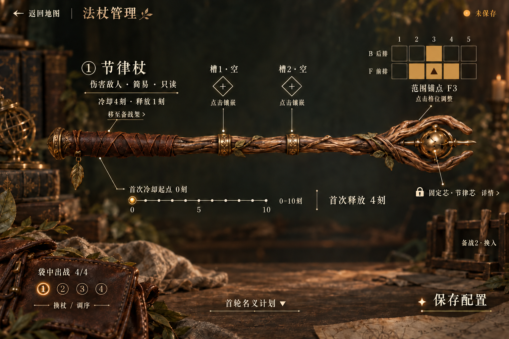
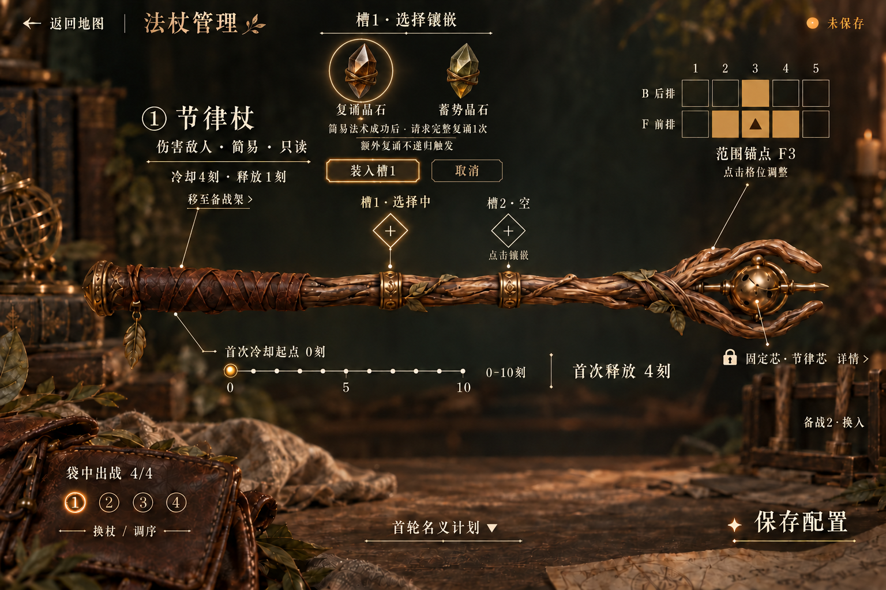

# 悬浮投影 · 主界面与镶嵌展开细化

2026-09-19。**ProjectionDirectionSelected / RefinementDraft**。用户已选择悬浮投影方向，本轮细化两个状态；这是内置image_gen生成的效果稿，不是Blender或引擎渲染。

[设计说明与功能来源](design.md) · [实际图像检查](visual-review.md) · [原图与提示词来源](provenance.json)

## 主界面

保留横置法杖与无底板投影。两枚空槽加上加号和点击提示；固定芯使用明确“详情”入口；移至备战架靠近当前对象信息。范围B3/F2/F3/F4统一填色，F3另外叠锚点。名义计划及固定芯长说明保持折叠。

## 槽1展开

选择槽1时，就地出现两件候选的投影、短说明及装入／取消。槽1还没安装，槽2仍为空，固定芯锁定。复诵晶石／蓄势晶石均来自已有规则，画面是假设已购入两件物品后的库存示例；候选物件的外观仍为概念造型。

本帧没有大弹窗或配置底板。图像模型为容纳展开内容把法杖与时间控件略向下移动，因此两张不是几何注册的动画关键帧；实际UI建议保持法杖位置固定，只展开投影区域。

## 提示词与保留文件

- [主状态初稿提示词](main-initial-prompt.md)与[初稿](main-initial.png)：先增强操作标记，仍有锚点格填色遗漏。
- [四格填色修正提示词](main-range-correction-prompt.md)：仅针对范围可读性；选用结果为main.png。
- [镶嵌展开提示词](slot-open-prompt.md)：以修正后的主状态作为输入。

两张选用图均1536×1024，按工具原始字节归档。当前只是界面细化草稿；精确字形、投影透明度、点击区域、焦点、键盘操作、装入确认、调序和保存尚未制作。原生资产仍为保留的v03。
