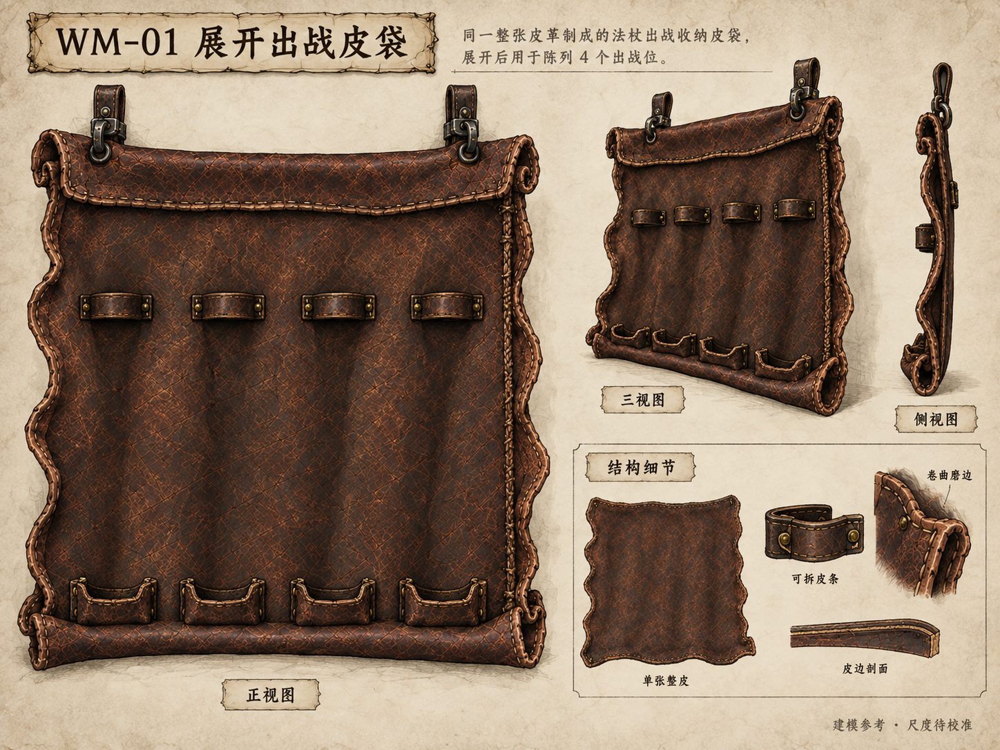
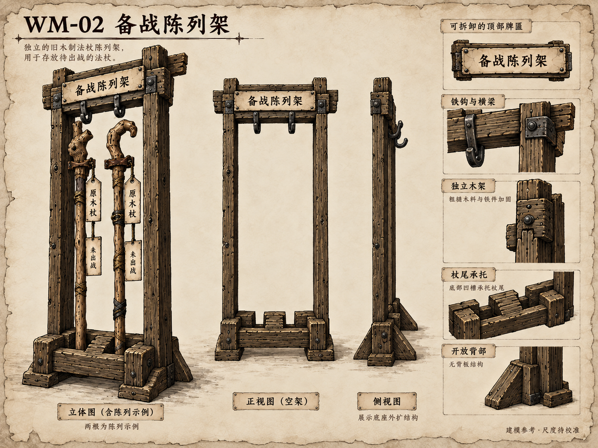
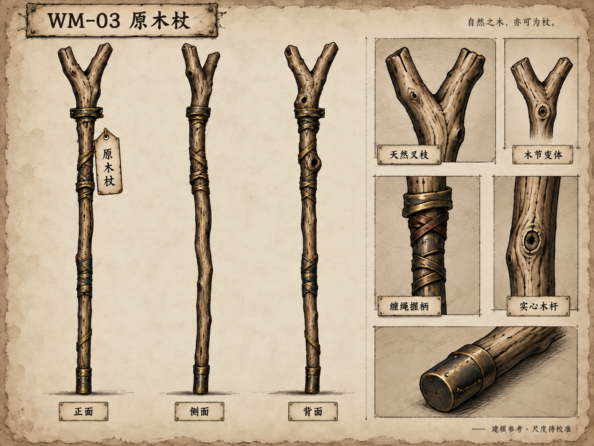
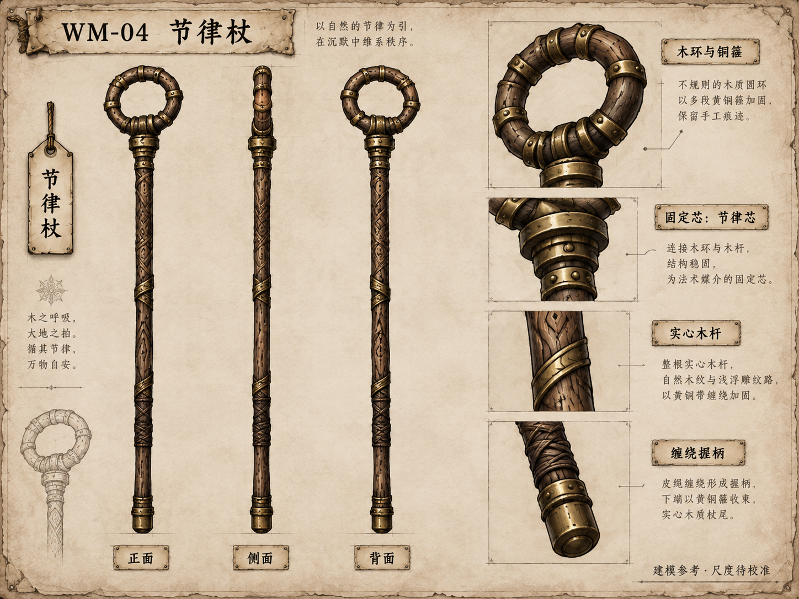
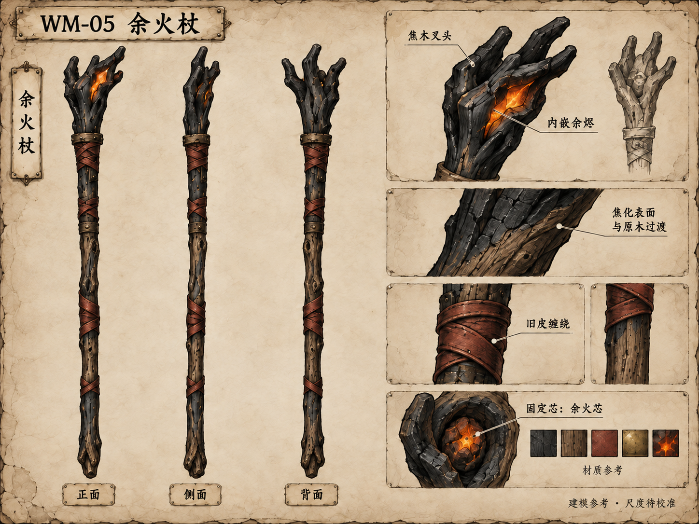
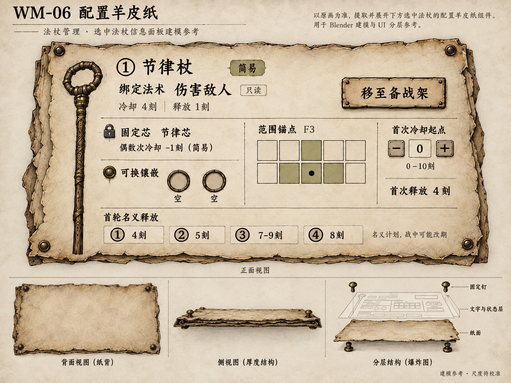
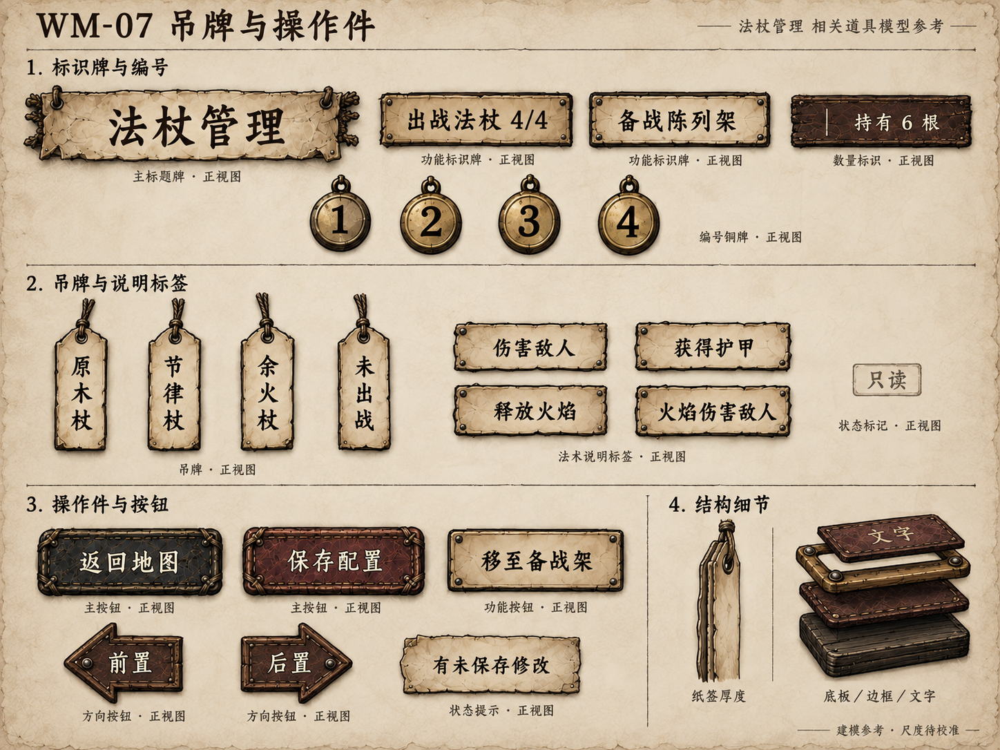

# 法杖管理 · Blender 组件参考图册

2026-09-14。**OverallDirectionConfirmed / ComponentDesignDraft**。

用户已确认[整体 v03](../wand-management-overall-v03.png)，本批将已通过的“袋中出战、架上备战；法术与词卡不在本页编辑”拆成七组。以下均为 **1448×1086 的图像模型参考稿**，尚非原生 .blend 或配准工程图。

[中文建模说明](../../docs/blender-wand-management-components-v01.md) · [整体设计文稿](../../docs/wand-management-visual-design-v01.md) · [原图、提示词与 SHA 清单](manifest.json)

| 编号 | 组件与当前选用图 | 主要内容 | 完整提示词 |
| --- | --- | --- | --- |
| WM-01 | [展开出战皮袋](wm-01-deployed-leather-v01.png) | 一张连续皮革、四个固定环与四个杖尾托位；正面、斜视、侧面、皮条／卷边细节。 | [本图提示词](wm-01-deployed-leather-v01-prompt.md) |
| WM-02 | [备战陈列架](wm-02-reserve-rack-v01.png) | 独立开放木架；含两根示例杖的主视、空架正面、侧面及铁钩／底座结构。 | [本图提示词](wm-02-reserve-rack-v01-prompt.md) |
| WM-03 | [原木杖](wm-03-raw-wood-staff-v02.png) | 天然叉枝轮廓；正侧背、木节变体、握柄与杖尾细节。选用 v02，去掉额外铜铃。 | [本图提示词](wm-03-raw-wood-staff-v02-prompt.md) |
| WM-04 | [节律杖](wm-04-rhythm-staff-v01.png) | 空心木环与旧铜箍；正侧背、环头连接、实心木杆与握柄细节。 | [本图提示词](wm-04-rhythm-staff-v01-prompt.md) |
| WM-05 | [余火杖](wm-05-ember-staff-v02.png) | 焦木叉头、局部内嵌余烬和旧皮缠绕；选用 v02，去掉额外铜铃。 | [本图提示词](wm-05-ember-staff-v02-prompt.md) |
| WM-06 | [配置羊皮纸](wm-06-configuration-parchment-v01.png) | 只读法术信息、固定芯与两空槽、正确 F3 范围；纸面／钉／文字状态层分开。 | [本图提示词](wm-06-configuration-parchment-v01-prompt.md) |
| WM-07 | [吊牌与操作件](wm-07-tags-and-controls-v01.png) | 标题牌、出战与备战标牌、四枚序号、吊牌、只读法术标签、返回／保存／退架／排序操作件。 | [本图提示词](wm-07-tags-and-controls-v01-prompt.md) |

每张图内不同视图的比例和透视只作造型参考，不能直接作为尺寸标定。新组件稿等待美术评议；整体 v03 的通过状态不再待确认。

## WM-01 · 展开出战皮袋

一张连续皮革、四个固定环与四个杖尾托位；正面、斜视、侧面、皮条／卷边细节。

## WM-02 · 备战陈列架

独立开放木架；含两根示例杖的主视、空架正面、侧面及铁钩／底座结构。

## WM-03 · 原木杖

天然叉枝轮廓；正侧背、木节变体、握柄与杖尾细节。选用 v02，去掉额外铜铃。

## WM-04 · 节律杖

空心木环与旧铜箍；正侧背、环头连接、实心木杆与握柄细节。

## WM-05 · 余火杖

焦木叉头、局部内嵌余烬和旧皮缠绕；选用 v02，去掉额外铜铃。

## WM-06 · 配置羊皮纸

只读法术信息、固定芯与两空槽、正确 F3 范围；纸面／钉／文字状态层分开。

## WM-07 · 吊牌与操作件

标题牌、出战与备战标牌、四枚序号、吊牌、只读法术标签、返回／保存／退架／排序操作件。

## 修订与保留

[原木杖初稿](wm-03-raw-wood-staff-v01.png)和[余火杖初稿](wm-05-ember-staff-v01.png)仅保留来源追踪，生成时多出的铜铃已在当前 v02 中移除。其[初稿提示词之一](wm-03-raw-wood-staff-v01-prompt.md)与[初稿提示词之二](wm-05-ember-staff-v01-prompt.md)一并保留。本批共生成九张，选用七张；所有图片按原字节复制，未做插值放大、拼图或后期拼字。

已有右侧模型、MD-11 长袋和 Godot E1 R2 保持原阶段。下一制作步骤是按本批组件稿校准比例并建立原生模型，组件稿本身不代表模型或交互已经完成。

