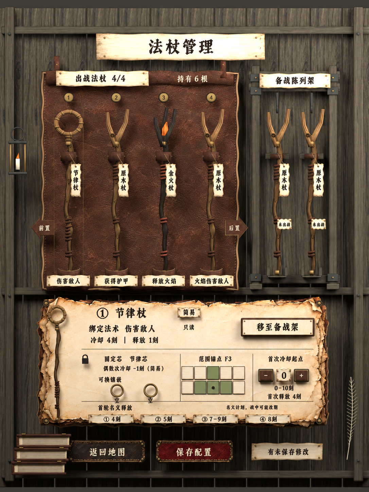
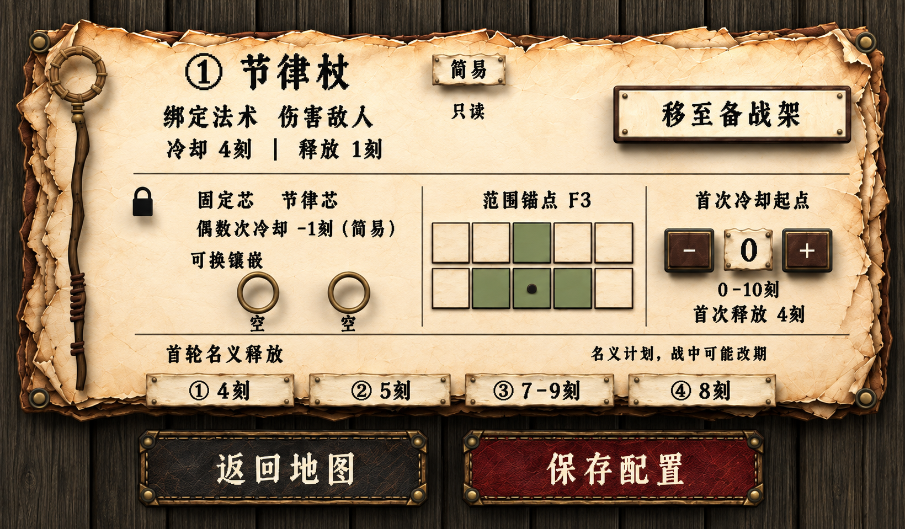

# 法杖管理 · Jacquard 24 风格中文效果探索

2026-09-19。**TypographyVisualDraft / NeedsReview**。用户指定 Jacquard 24 截图和 [Google Fonts 页面](https://fonts.google.com/specimen/Jacquard+24)，要求先出效果展示，不需要中文字体代码化。本次使用内置 image_gen，对当前 v03 渲染进行文字风格编辑。

这是借鉴像素哥特字形气质的中文绘制示意，不是 Jacquard 24 官方中文字库，也不是更换字体后的 Blender 实机渲染。原 v03 模型、材质及字体没有修改，未制作／安装字体文件。

## 整页效果

主标题、分区标题、吊签与按钮采用更厚的竖画、方折收笔、菱形／阶梯切角；小字仅表达同一方向。六杖分组、袋／架分离、纸面和按钮配色沿用当前页面。

## 局部字体效果

局部图由生图模型重新呈现，用于观察字体气质；不是无损裁切，也不保证与整页每个笔画完全一致。图中保留两槽、十格范围、B3/F2/F3/F4四格与主要参数。正文粗细和像素边缘的统一仍是后续美术校准项。

建议优先评议标题与保存／返回按钮的字形，确认方向后再统一小字号笔画。当前未把这版绘制提升为正式字体规范或实现完成。

[整页提示词](full-page-prompt.md) · [局部提示词](detail-prompt.md) · [用户字体截图](jacquard24-user-reference.png) · [来源与原图哈希](provenance.json) · [未改动的Blender v03](../../art/wand-management-v03/README.md)
