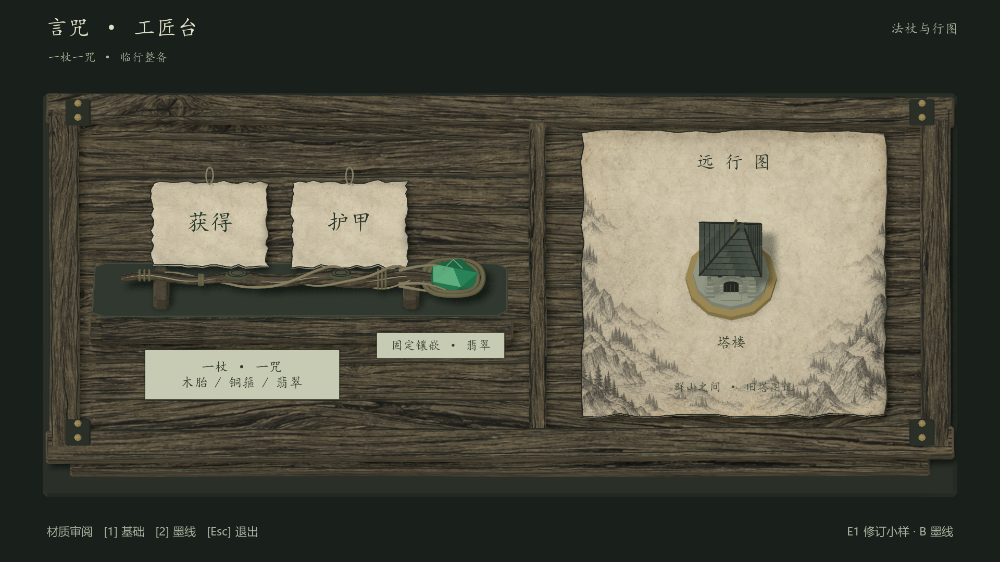

# E1 R2：同一页面的材质与原生模型修订

2026-09-13。来源为用户本轮明确要求：继续当前页面，用图像模型补充参考，并通过电脑插件控制 Blender 细化建模。当前为 **Executed / NeedsRevision / user review pending**，技术检查通过，美术仍属于实验稿。只修 E1 工匠台，E2–E4 保持 NotRun。

## 当前实机



[720p](evidence/E1-r2/godot-ink-1280x720-final.png) · [基础材质对照](evidence/E1-r2/godot-base-1920x1080-final.png) · [Blender 渲染](evidence/E1-r2/blender-ink-1080.png) · [R1 对照与历史结论](e1-report.md)

上图为 Godot 原生 GPU 视口截图。中文由 Godot 实时绘制；造型参考板未作为背景图或贴片导入游戏。木纹和地图纸是图像模型生成的 albedo，贴到可编辑 3D 几何上。

## 本轮改动与来源

- 新生成 [法杖／石塔造型板](../references/e1-r2-generated/wand-tower-modeling-board-v01.png)、[灰褐墨线木纹](../references/e1-r2-generated/wood-ink-albedo-v01.png)、[边缘群山地图纸](../references/e1-r2-generated/map-paper-albedo-v01.png)。[提示词、用途和来源清单](../references/e1-r2-generated/README.md)保留原始输出与哈希；未对原图做 Python 位图处理。
- 通过电脑插件实际打开 Blender，进入屋顶编辑模式，把顶面沿世界 X 移动 0.18，形成偏斜剪影，并通过 Save As 保存 [UI 编辑源](../art/e1/e1-r2-ui.blend)。这是一次明确的 UI 网格编辑；重复瓦片、石砌和 UV 细节由原生 bpy 补充，未宣称全程手工建模。
- [后处理脚本](../art/refine_e1_r2.py)从 UI 源打开场景，保留屋顶四个改变的顶点及拓扑、对象变换；沿真实斜面生成瓦片，增加门拱、错缝石砌、窄窗、扶壁。相机倾斜增大，使塔楼正面与入口在同页可见。
- 木框有轻微形变，各板采用不同窄 UV 取样；法杖补充木节、根须、旧铜箍及深翡翠分面。实机发现杆身与木纹混杂后，增加深色低矮内衬与间断木脊高光，改善轮廓。纸签使用短绳环，纸面改为低饱和灰米色。主标题和纸签改用本机楷体优先回退，调试说明留在页脚。

几何范围仍为一根法杖、一个固定镶嵌、两张纸签、一个地图纸及一个遭遇塔楼。地图里的山林只是装饰；没有装配、选路或词效执行。

## 验证

最终数值与文件哈希以 [verification.json](evidence/E1-r2/verification.json)、[R2 资产清单](../art/e1/asset-manifest-r2.json)为准。

本轮最终为 446 个网格／曲线对象、56,229 三角面；Godot 每版 459 个节点，保存前后相同。基础／墨线 GLB 分别为 1,953,080／8,269,472 bytes。C# 构建 0 警告、0 错误。已目视检查最终 1080p 与 720p 墨线图、Blender 渲染；地图底部说明仍受山林纹理轻微干扰，可作为后续同页修订项。

- [UI 修改审计](evidence/E1-r2/ui-edit-audit.json)对比 R1 与 UI 源：屋顶恰有 4 个顶点变化，拓扑与对象变换不变；后处理前后屋顶网格哈希相同。
- 同一几何导出基础／墨线两版，检查位置、索引、节点变换与相机一致；材质变化是 A/B 的差异来源。
- 编译、GLB 导入、场景打包前后节点一致、GLB 保持实例；原生 NVIDIA Vulkan 两档分辨率各两张 PNG，检查文件头尺寸、7 个标注边界与中文字形；运行 stderr 为空。
- R2 的来源验证覆盖 UI 输入、生成脚本、三份图像、可编辑 master、两份 GLB 和审计证据的 SHA-256，防止把旧截图作为当前修订结果。

木纹和地图的手绘气质较 R1 明显增强，石塔正面也更容易辨认。当前构图仍是部件风格小样：塔楼形体偏规整，金属与宝石的明暗层次仍简化，未达到 FLASK 参考的叙事装饰密度。这些是美术观察，不是用户已认可相似度的结论。无持续性能测试、交互测试或发行验证。

## 复现与继续编辑

```powershell
.\tools\build-e1-r2.ps1
.\tools\capture-e1.ps1 -Revision r2
. .\tools\env.ps1
& $BlenderExe --background --python-exit-code 1 --python art/audit_e1_ui.py
& $PythonExe tools/verify-e1.py --revision r2
.\open-e1.ps1
```

只改 C# 时用 `build-e1-r2.ps1 -SkipAssets`。可编辑细化成品是 [e1-r2-master.blend](../art/e1/e1-r2-master.blend)，其纹理已打包；后续若直接编辑成品，应另存并调整重建输入，避免重新执行脚本覆盖新增手动修改。R1 master、生成器、manifest 和 docs/evidence/E1 保留。

当前提交用于技术与美术实验，不改变 game-002 核心构思、GDD 或原始想法的 Raw / Unqualified 状态。下一步继续评议此页的轮廓与材质即可。
