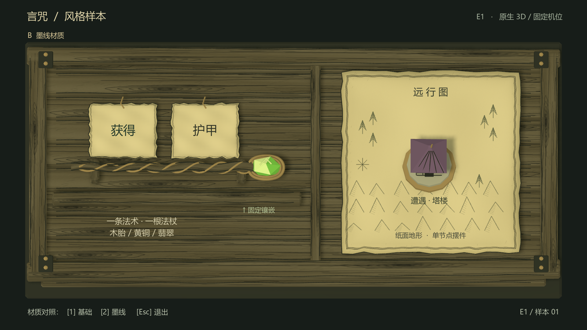

# E1 风格小样：首轮实机结果

2026-09-13。用户明确启动 E1；本轮状态 **Executed / NeedsRevision**。技术链路通过，尚未达到 FLASK 参考的美术完成度，用户风格评议待进行。E2、E3、E4 仍为 NotRun。

## 实机结果



[基础版 1080p](evidence/E1/godot-base-1920x1080-final.png) · [墨线版 720p](evidence/E1/godot-ink-1280x720-final.png) · [基础版 720p](evidence/E1/godot-base-1280x720-final.png) · [Blender 墨线渲染](evidence/E1/blender-ink-1080.png) · [Blender 基础渲染](evidence/E1/blender-base-1080.png)

这些是原生 Blender 源资产与 Godot GPU 视口的实际输出。未将概念图或参考截图导入运行画面。Blender 图没有中文 UI；Godot 的词签及说明由 Control/Label 绘制。两引擎使用同一导出相机，光照模型有差别，不宣称逐像素一致。

样本包含：一个木框截面、一根法杖、一个固定翡翠镶嵌、两张纸签、一张地图纸和一个塔楼遭遇摆件。山与树是地图装饰，未生成路线节点或可操作地图。文字“获得 / 护甲”仅作为当前设计背景中的装配显示样例，未实现词效。

## 验证与判断

| 项目 | 结果 | 证据或限制 |
| --- | --- | --- |
| Blender → GLB → Godot | Passed | 原生 bpy 生成；保存带打包纹理的 .blend；两份 GLB 成功导入 |
| Godogen 场景构建 | Passed | C# 编译 0 错误、0 警告；A/B 各 115 个节点，保存前后相同；GLB 保持实例，场景文件不足 2 KB |
| A/B 公平对照 | Passed | GLB 位置/索引缓冲、节点变换、相机数据相同；区别为纹理和轮廓材质颜色；两版都有相同轮廓几何 |
| 真实 GPU / 分辨率 | Passed | NVIDIA RTX 5060 Laptop / Vulkan / Forward+；直接读取 GPU 视口，PNG 文件头确认各两张 1920×1080 与 1280×720 |
| 本样本中文 | Passed / limited | 实时字体字符覆盖和 7 个物件标注边界通过；1080p 最小 22px，720p 最小 16px；人工查看两档墨线图未见裁切 |
| 纸面与暗底亮物 | Partial | 纸边与文字留白成立；纸面仍偏黄，整体缺少参考中更鲜明的明暗组织 |
| 木框排线 | NeedsRevision | 降低线密度、改变 UV 取样后改善了条纹挤压；仍有重复木节和机械平行感，未达到手绘雕刻感 |
| 法杖与摆件轮廓 | NeedsRevision | 固定镶嵌可辨；法杖轮廓简单，塔楼在当前俯角下主要露出屋顶，缺少参考的叙事细节 |
| 参考风格相似度 | NeedsRevision | 墨线版方向更接近，不能据此宣称已经做成截图风格；未用虚构相似度分数或构建成功替代美术评议 |

机器证据：[verification.json](evidence/E1/verification.json)。完整构建与四次原生运行日志随证据保存。无运行 stderr。无头检查只确认场景启动；它的 dummy viewport 不能用于视觉验收。

102 个网格/曲线对象，求值后 **19,034 三角面**。基础 GLB 3,304,676 bytes，墨线 GLB 3,454,176 bytes。每版使用木纹 1536×192、纸签 1024×1024、地图 1024×1024；[资产清单](../art/e1/asset-manifest.json)记录导出哈希、相机和固定种子。上述是样本实测，不代表整屏性能预算。

## 已修复的问题与剩余风险

- 初版纸面平面法线产生三角明暗块，改为平滑法线；木纹排线在狭长木板上压缩成密条纹，减少笔划、调整纹理比例与 UV 后重新导出。
- Godot Label 先赋尺寸再覆盖字体会保留较大的初始最小尺寸；改为字体设置完成后赋尺寸。原生两档字号与投影边界均重新检查。
- `--resolution 1920x1080 --write-movie` 本机仍输出项目配置的 1280×720。最终改用帧绘制后 `GetViewport().GetTexture().GetImage()` 保存，检查文件头，未将早期电影帧作为交付证据。
- 轮廓来自实体细线与 UV 墨线，未使用依赖屏幕深度的后处理描边。固定机位下已检查；镜头运动和动态排线稳定性尚未测试。
- 中文使用本机 `Microsoft YaHei` SystemFont，未复制或分发字体文件。发行时需单独选择可再分发字体；当前不做字体许可或发行包验收。
- 没有运行 60 秒性能测试，也未验证长词条、可选/占用等交互状态、窗口任意缩放、全屏合并、干净机器重导入。E1 审阅窗口固定 16:9，两档分辨率分别启动。

## 文件与复现

在工作区 PowerShell 中执行：

```powershell
.\tools\build-e1.ps1
.\tools\capture-e1.ps1
. .\tools\env.ps1
& $PythonExe tools/verify-e1.py
.\open-e1.ps1
```

`open-e1.ps1` 打开实际审阅窗口；1/2 切换基础/墨线，Esc 退出。无需运行装配或地图逻辑。只修改 C# 时可用 `build-e1.ps1 -SkipAssets`。

- [可编辑 Blender 主文件](../art/e1/e1-style-master.blend)：102 个可编辑模型/曲线对象、相机、材质及打包贴图，默认墨线版。
- [原生资产生成脚本](../art/build_e1.py)：bpy 和 Blender 自带 numpy；几何、纸边、木纹、地图装饰均为本实验原创建模或程序绘制。
- [场景构建器](../game/builders/BuildE1.cs)、[显示脚本](../game/scripts/E1View.cs)：场景实例与实时中文投影，未实现游戏规则。
- 运行资产位于 game/assets/e1；原始 PNG 与 .blend 位于 art/e1；当前重建输出位于忽略的 artifacts/ui-experiment/E1；本轮审阅证据固定保存在 docs/evidence/E1。

## 下一轮仍应停在 E1

建议先针对同一小样修三个地方：木框改成更明显的不对称剪影并为主要木板单独组织排线；法杖增加有节奏的粗细、端部镶嵌包边与黑色轮廓；调整塔楼侧面露出比例并减弱纸面黄光。保持同一组资产和 A/B 方法，让用户判断方向是否足够接近后再考虑 E2。

本轮是技术实验与美术观察，不提升 game-002 原始视觉想法的资格，也不改变核心构思、GDD 或已采纳玩法。
