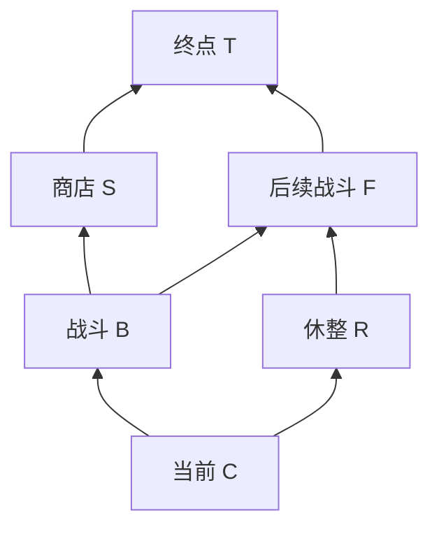

# Godogen / 原生 Blender / Python：视觉与 UI 实验计划 v0.1

日期2026-09-13。状态 Draft / NotRun；研究与概念效果图已完成，实机实验尚未开始。技术栈沿现有环境，不切换引擎或启用MCP。目标是检验[视觉方向01](visual-direction-v01.md)能否变成可维护、可读、可操作的两屏界面；不是开发完整游戏。

## 先后与停止条件

| 阶段 | 制作范围 | 交付与检查 | 未通过时 |
| --- | --- | --- | --- |
| E0 参考与构图 | 截图、关键视频画面、当前规则；一版两屏效果图 | 本轮已完成，ConceptDraft；不计入实机证据 | 用户评议后修方向 |
| E1 风格小样 | 一段木框、1根法杖及固定镶嵌、2张纸签、1块地图纸、1个节点摆件；固定机位 | 同机位的Blender源与Godot实机图；比较基础材质和墨线材质两版；文字仍由UI绘制 | 先调整轮廓、色块、排线和光照，不扩充资产 |
| E2 装配交互 | 2根示意法杖、6张词卡；分配/撤回、占用标识、顺序、起点、信息栏 | 20秒实际操作录像＋关键状态截图；非法重复分配不改变数据，移除后占用释放 | 简化布局、先保留点击操作，修清晰度再加拖动 |
| E3 地图交互 | 6节点固定有向图；下一步预览、进入、已走状态、资源与构筑摘要 | 预览不推进，进入只沿相邻边，不能回访；两分支各跑一遍并截图 | 优先清除路线遮挡和状态歧义，缩小摆件，禁止改图掩盖错误 |
| E4 合屏与维护验证 | 两屏共享框架、缩放、截图与资源再生成 | 1080p/720p截图；干净资源再导入；改一次材质/词卡数据，两屏同步更新 | 明确剩余限制；不把勉强运行判为风格通过 |

每阶段单独留下 Passed / NeedsRevision / Failed 及证据路径。E1确认之前不制作全量词卡/敌人/地图，E2/E3不接完整战斗、数值校准器、随机生成地图、经济成长、存档或发行包。

## 待验证的技术分工

- Blender：简单可编辑几何、木框/法杖/地图摆件/纸边厚度、UV和可修改材质。先用简化光照与手绘贴图建立色块，试验描边及固定在物体上的排线，避免线条随镜头闪烁。
- Python：通过Blender内置bpy创建/更新资产、设置材质和导出GLB；保留参数与脚本。外部Python只负责清单/哈希/批处理，不取代游戏运行逻辑。
- Godot：固定相机与浅层3D；用Control绘制真正可读的中文、牌面数值、按钮和命中区域，避免把整屏文字烘进图片。C#维护选择/占用/路线状态，Godogen构建器生成场景并验证节点保存。
- 纹理是关键成本：原生Blender和Python能自动生成结构与基础排线，但不能仅靠堆几何保证参考的美术完成度。需要反复调材质或在Blender中绘制贴图。当前AI效果图只用于对照，不导入为整屏背景冒充3D实现，也不暗中换成云端资产生产链。
- 先测真实浅3D方案。若描边/排线不可稳定，可在同一Godot工程内比较Blender渲染的局部2D资产；这属于待报告的技术折衷，不能仍宣称全部界面物件实时3D。

## 建议验收标准（本次新设目标，尚未测得）

| 维度 | 检查方法与通过信号 |
| --- | --- |
| 风格 | 固定构图对照源参考与E1实机：木框轮廓、墨线排线、纸面、暗底亮物四项均可辨，用户确认方向接近；不用任意AI相似度分数代替审阅 |
| 中文 | 1920×1080下主要规则正文建议≥22px，1280×720下≥16px；最长候选词名无裁切，信息层不被3D遮挡；字体许可单独记录 |
| 区分状态 | 可选、已选、占用、不可用都有文字/符号或线型差别，灰度截图仍能识别；不是只变绿色 |
| 详情层 | 重要说明不覆盖当前操作目标，边缘卡片详情始终在屏内；长词条不会挤掉按钮 |
| 装配正确性 | 同一实体不能进入两条法术；撤回恢复可用；每杖显示的是完整法术；固定镶嵌不被当成词卡；起点只接受整数0–10 |
| 顺序与时间 | 显示顺序与数据一致；起点调整仅改变首次冷却起点。完整时序未接入时写“配置预览”，不伪造周期/覆盖结果 |
| 地图正确性 | 6节点/7条已登记有向边；浏览不移动；进入后相邻资格更新；不得逆行、跳层、回访或因查看重新生成 |
| 可解释性 | 先做任务走查：能找到未占用卡、说出当前法术属于哪根杖、辨认下个可进入节点与商店/休整；若可邀请3位新读者，目标每人5项任务至少4项完成，结果仅为小样证据 |
| 性能 | 目标本机RTX5060、1080p、稳定交互60fps；预热后录60秒，报告中位及P95帧时间，建议P95≤16.7ms。以实际测量为准，截图电影模式不能当运行帧率 |
| 可维护性 | 保存.blend、bpy脚本、GLB、字体/材质来源；重建不丢节点，普通词卡更名无需重画整屏；无资产缺失或运行错误 |

模型资产三角面数、纹理尺寸和显存预算在E1测量后设定，当前不凭空承诺。1280×720重排是否采用收起侧栏，由截图可读性决定。

## 实验输入与证据

规则来源见visual-direction-v01；夹具只含6张词卡、2根法杖和6节点。容量、额外镶嵌数、敌人规则与数值一律不由构图确定。用“待配置”占位，不导入已经搁置的词效。

实施后每阶段保存：输入版本与Git提交、资产清单、实机截图、可重复操作脚本/步骤、观察、未通过项。源内容归art/，运行资产归game/assets/，证据归artifacts/ui-experiment/E1等，经过审阅的报告归docs/。当前这些目录不代表已经有实现。

E3的确定性路线夹具（6节点、7有向边；优先于概念位图）：

下一步建议：先评议概念图，再单独启动E1；目前止于交付设计图与计划。
