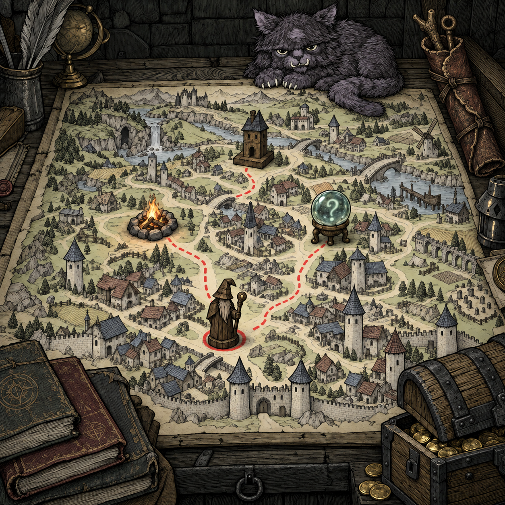

# 地图桌面 · 视觉设计 03：旧皮革法杖袋

2026-09-13。状态：**OverallRevisionAwaitingConfirmation**。本轮只更新整体效果图，等待用户确认；新增组件稿与Blender资产尚未开始。上一版已完成的九类三维资产继续保留。

[完整提示词](../concepts/map-desk-overall-v03-prompt.md) · [来源与哈希](../concepts/map-desk-overall-v03-manifest.json) · [上一版整体图](../concepts/map-desk-overall-v02.png) · [现有三维资产](../art/map-desk-v01/README.md)

## 本轮指定内容

用户：“右侧再加入一个破旧的法杖袋（由整张的旧皮革卷成），斜靠在桌子右后侧，末端露出一到二支法杖头；后续将其作为法杖管理入口。先更新整体效果图，确认后再新增组件效果图、再新建blender资产”。

新增物件预留编号 **MD-11 旧皮革法杖袋**。MD-09猫的模型继续暂缓，已有编号不调整。

| 项目 | 本版处理 |
| --- | --- |
| 位置 | 袋底落在右侧纸面外的木桌沿，袋身向右后侧靠置；处于前景宝箱之后 |
| 结构 | 整张旧皮革包卷成长袋，开放卷口、外层搭接边、底部折回收口，两道细皮带捆扎 |
| 旧化 | 深棕旧革、浅色破边、褶皱与磨损，沿用整体的密集墨线与排线 |
| 外露法杖 | 选用两支：叉枝形木杖头、环形木杖头；主体藏在袋内，头部完整入画 |
| 功能指向 | 用户已明确其后续作为法杖管理入口；本图先保证物件可识别，没有添加按钮或交互状态 |
| 既有构图 | 地图与红线、四类节点、左下书、右下宝箱及杂物保留；原概念中的猫略向左移，右边灯具稍下移，为袋体腾出位置 |

两支杖头的具体造型、两道绑带及局部摆位是本轮视觉表达选择，尚待整体评议；图中外露数量不定义库存或容量。袋子是地图桌面的入口物件，不据此新增携带上限、抽取动作、装备规则或地图选路规则。

## 图像检查

本图用内置imagegen编辑已确认的手绘整体概念02，并非修改Blender渲染或实际模型。生成原图1254×1254，按字节复制进入concepts，保存完整提示词与SHA256。

已人工查看整体：右后袋体、卷边、绑带和两支杖头可辨认，杖头未裁切；红色路线和四个节点未被袋子遮住，杂物保留。参考中的猫仅随既有概念保留，没有生成新的猫组件图或模型。生成图存在少量纹理与摆位变化，不主张与上一图像素级一致，也不作为原生几何或实机验证。

## 后续顺序

1. **当前：整体确认。** 评议袋体大小、斜靠位置、皮革卷制感与露头比例。
2. **整体确认后：新增组件效果图。** 为MD-11制作Blender设计稿，补齐正／侧／背参考与整皮包卷、卷口、底折、绑带、杖头的拆件说明。
3. **随后：新增Blender资产。** 依组件稿新建独立可编辑资产，再加入组合工程、渲染并检查；现有资产采用追加版本保存。

“法杖管理入口”的用途已记录；点击或悬停反馈、进入何种管理界面及其操作范围尚未设计，本轮不实现交互。当前只等待整体图确认，不自动启动后两步。
