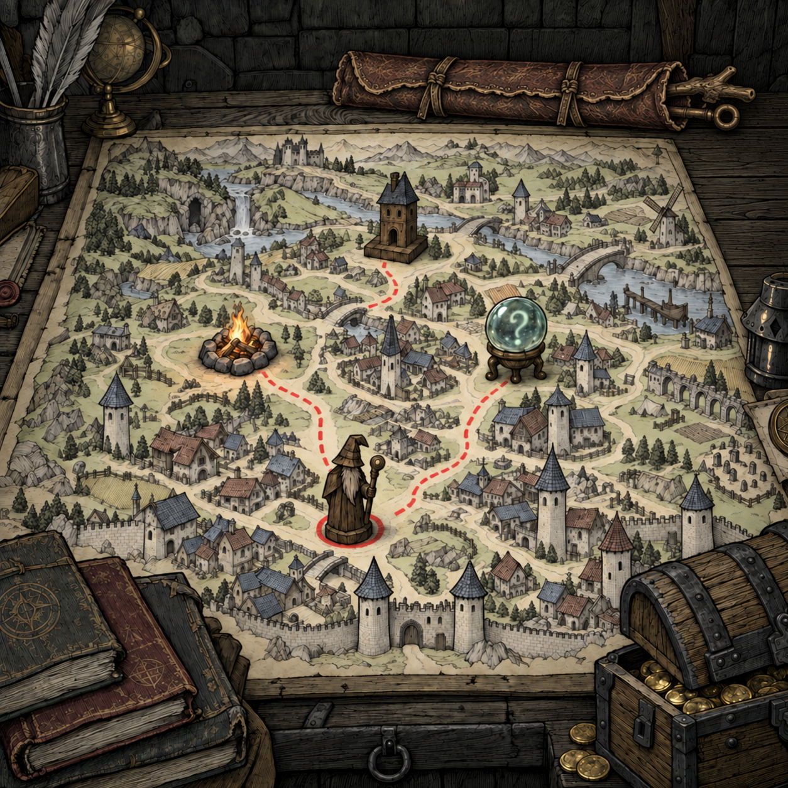

# 地图桌面 · 视觉设计 04：横置长法杖袋

后续修订：用户进一步明确“长法杖可以和桌子差不多长甚至更长”。[整体设计05](map-desk-visual-design-v05.md)已继续加长，本页保留首次删猫与横置的历史版本；后续长度以05为准。

2026-09-13。状态：**BagAppearanceConfirmed / OverallRevisionAwaitingConfirmation**。用户认可03版法杖袋形象，本轮按新要求删猫、移位并加长袋身；新版整体待确认，MD-11组件稿和Blender资产尚未制作。

[完整提示词](../concepts/map-desk-overall-v04-prompt.md) · [来源与哈希](../concepts/map-desk-overall-v04-manifest.json) · [上一版说明](map-desk-visual-design-v03.md)

用户：“目前法杖袋形象设计没问题，把猫从图中删去，法杖袋代替猫的位置横向靠在后侧，做的长一点”。

## 本版修改

- 猫从当前整体图完整移除，原处恢复木墙和桌面后沿；旧参考图作为历史保留。
- MD-11法杖袋占据原猫位置，沿后侧木沿横放靠置，左端收口，右端袋口露出两支杖头；原来右边竖斜放的袋子移走，场景只有一只袋子。
- 袋身加长，保留原直径的大致视觉比例、整皮包卷结构、搭接边、两道绑带、破损旧化与墨线。提示词以约1.5倍原袋身长度控制构图，该比例不是用户指定尺寸或建模定值。
- 叉枝形和环形两支杖头随袋身转为朝右，均完整入画；中央地图、红线、四类节点、书、宝箱与其余杂物保留。

法杖袋后续作为法杖管理入口的用途不变；外露杖头数量不代表库存或携带上限，当前未新增交互规则。

## 交付与后续

由内置imagegen以03版整体图为底图编辑，输出1254×1254，原图按字节复制、提示词与SHA256归档。人工查看确认无猫、只有一只横向长袋、杖头未裁切、没有遮住节点和红线；图像局部纹理有生成变化，不主张像素级一致。

本轮只完成整体效果修订，不是Blender或Godot新渲染。现有九类原生资产仍为5686534。按用户既定顺序，确认新版整体后，先生成MD-11组件建模设计稿，再新建原生Blender资产；MD-09猫不进入当前画面或新增资产清单。
