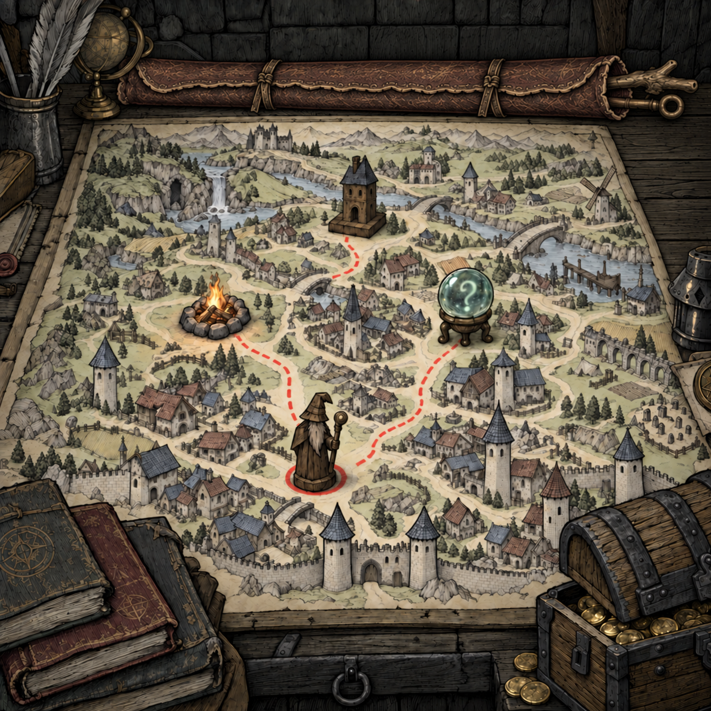

# 地图桌面 · 视觉设计 05：接近桌宽的长法杖

2026-09-13。状态：**BagAppearanceConfirmed / OverallRevisionAwaitingConfirmation**。

[完整提示词](../concepts/map-desk-overall-v05-prompt.md) · [来源与哈希](../concepts/map-desk-overall-v05-manifest.json) · [前版位置修订](map-desk-visual-design-v04.md)

最新原话：“再长一点，长法杖可以和桌子差不多长甚至更长”。此前用户已认可皮革袋形象，并要求删猫、将法杖袋横置后侧原猫位置。

本版沿用04版横放与删猫结果，将袋身继续向左延伸至羽毛笔／天球仪旁，右端袋口和两支杖头朝右。袋身加长而粗细大体不变；保留整皮包卷、搭接边、旧化、两道绑带和叉枝／环形杖头。图中长袋与外露部分接近后沿可见宽度，体现长法杖尺度。

后续组件与建模应允许法杖总长接近或超过桌宽，不再按短手杖比例缩小。提示词中的袖袋约桌宽85–95%、含露头约105–115%只是本次构图目标；生成图未做透视尺寸标定，不将其作为已测量或用户指定的精确比例。法杖大部分藏在袋内，外露数量仍是一至两支的视觉要求，不定义库存或容量。

内置imagegen编辑04版原图，1254×1254输出按字节复制并留存提示词与哈希。人工查看确认一只长袋、两支露头、无猫，地图红线与四个节点仍可见，书、宝箱和杂物保留；局部纹理存在生成变化。

当前只交付整体修订图。MD-11组件稿与Blender资产未开始，现有原生资产仍为5686534，Godot仍为E1 R2。按用户既定顺序，确认新版整体后，再生成MD-11组件建模设计稿，随后新建原生资产。法杖管理入口用途已记录，交互细节尚未展开。
