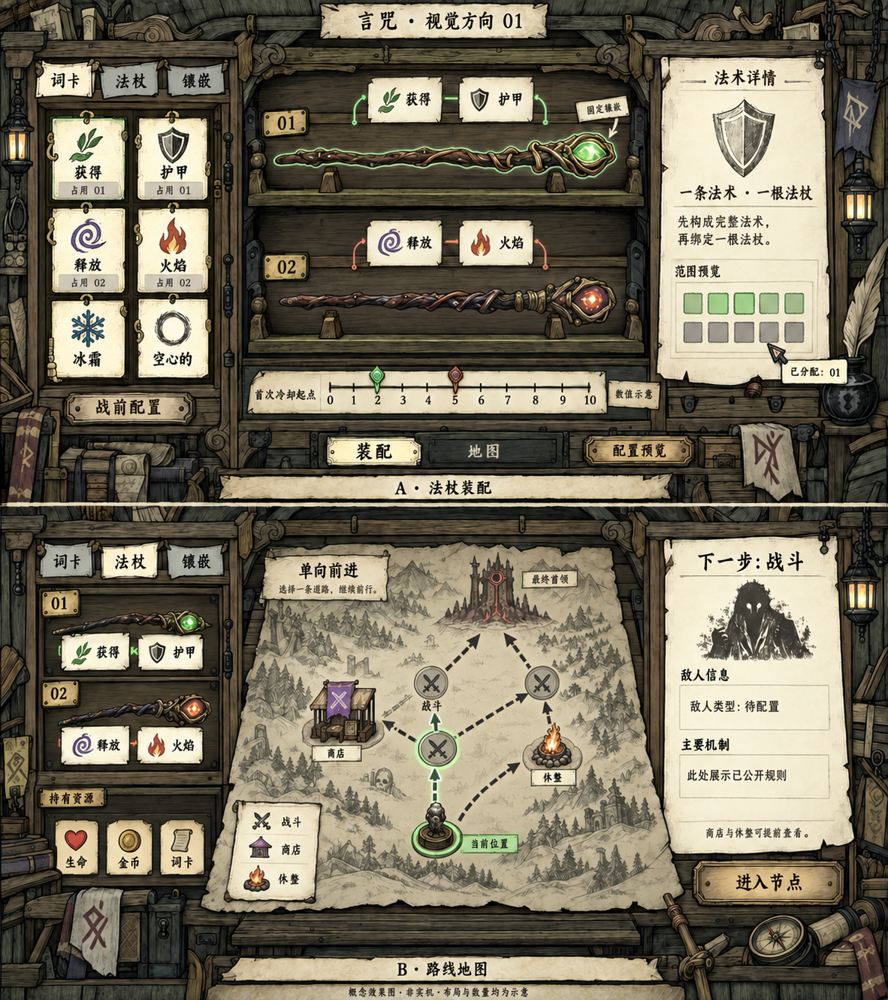

# 言咒：法杖柜与路线桌 · 视觉方向 01

2026-09-13。状态：VisualDesignDraft / AgentCandidate；实验计划 Draft / NotRun。用户已授权阅读参考、制作一版效果图与实验计划，尚未启动 Godot UI 实现。本文不是正式 GDD 或已采纳玩法。

## 效果设计图

这是 imagegen 生成并经规则文字修正的概念效果图，不是 Blender 或 Godot 实机。图内字体、图标、路径、槽位、选中态和所有示例数量都是待验证的表现。正式关系以本页文字与上游设计为准，不从生成图反推玩法。

已审图：修正了词卡/镶嵌混用、实体占用标记与自行生成的敌人机制。地图仍额外画出一个战斗节点、部分路径连接未严格服从指定图，因此只作美术构图示意；E3按下述6节点/7有向边的文字规格和计划中的关系图验收，不按这张位图统计拓扑。

## 已读资料与能支持的结论

| 来源 | 实际阅读范围 | 观察与限制 |
| --- | --- | --- |
| [用户原始截图](../references/flask-style-user-reference.png) | 全画面 | 木制分层柜、瓶形物品、吊牌、墨线排线、浅纸深字详情卡、少量亮色；截图为商店配置画面 |
| [子辰Spenda 的 FLASK 试玩](https://www.bilibili.com/video/BV1RaTb6bECe/) | 36:37 视频中抽看片段，非全片逐秒观看或转写 | 浏览器正常播放；下面逐项记录实际看到的时间点 |
| [02:48 左右](https://www.bilibili.com/video/BV1RaTb6bECe/?t=168) | 路线地图 | 左柜保留配置，右侧纸地图有虚线路径、圆节点及立在纸面上的遭遇摆件；地域插画与实际路径叠置 |
| [06:23 左右](https://www.bilibili.com/video/BV1RaTb6bECe/?t=383) | 战斗 | 中央空间更空，角色、生命与技能栏从背景中分离；细节主要在边缘与轮廓 |
| [11:34 左右](https://www.bilibili.com/video/BV1RaTb6bECe/?t=694) | 商店 | 左边柜体和配置持续存在，右边为售货橱窗，底部出口与类别标签；与用户截图属于同类界面 |
| [23:49 左右](https://www.bilibili.com/video/BV1RaTb6bECe/?t=1429) | 后段战斗 | 多角色状态栏仍采用深框浅纸，特效使用明显亮色；此处未据画面推断引擎或模型类型 |
| [30:51 左右](https://www.bilibili.com/video/BV1RaTb6bECe/?t=1851) | 地图上查看物品说明 | 左柜物品放大卡与旁侧关键词解释同时出现，右地图继续保留；说明层容易变大，需要单独验证遮挡 |

时间为浏览器 video.currentTime 读取并与实际画面核对，允许约1秒播放器显示差。视频的摆件立体感只作为视觉观察，不能证明原作采用真实3D。未下载或复用视频中的游戏美术。

当前设计仓库读取点为 `9f6e18c`，核心仍为 v0.6。已复核核心、镶嵌、路线、第一人称2×5方向、E3短规则和简易候选；另有两份语法素材的未提交删句，未据其旧例句补设计。引用此前保存的[设计来源清单](../references/design/manifest.json)作为基线；本轮新增来源观察不覆盖旧快照。

## 推荐视觉方向

**同一座法杖柜与工作桌，切换“装配”和“地图”。** 左边保持构筑身份，中央负责当前动作，右边负责解释。以可读的平面信息层叠加浅3D物件，先采用固定机位；3D的价值来自厚度、接触阴影与轻微视差。

| 参考的表现方法 | 在言咒中的转化 |
| --- | --- |
| 柜体组织物品 | 词卡库存按词性与占用状态组织；法杖按顺序排列 |
| 物品有明确容器与轮廓 | 词卡用纸签，完整法术用连接括线，法杖用木托，固定镶嵌嵌入杖体 |
| 亮色集中到互动对象 | 可选/选中状态有描边、符号与文字，避免只靠颜色 |
| 地图像桌上物件 | 地形图案作为背景，路径、箭头、节点与下一步说明具有更高视觉优先级 |
| 大卡面＋术语解释 | 详情在固定右栏承载；悬停层只补短提示，避免整屏遮挡 |

颜色建议为暗木褐、灰橄榄、暖纸白，辅以翡翠绿、暗紫和淡青。比例、色值、纹理密度均为美术候选。材质重点是大块明暗与可控线条，边角可以密，文字底必须安静；避免把画面统一染成褐色或让每个表面都闪亮。

## A：法杖装配页

建议首轮动作：**选一张尚未占用的词卡 → 放到指定法术的合法位置 → 看完整句子与对应法杖同步更新 → 调整法杖顺序或首次冷却起点 → 查看配置预览。** 这是本次提出的实验操作方案，待用户评议，不宣称已有正式交互设计。

- 左侧约24%：词卡/法杖/镶嵌分类，词卡有名称、图标和占用标记；已占用卡可见但不能再分配，不能假装多出实体副本。先实现点击分配与撤回，拖动为之后的便捷操作。
- 中央约50%：两根示意法杖，每杖对应一条完整法术。“获得 护甲”“释放 火焰”只作来源已有的表达示意，不在本轮补数值。词卡属于构句层，固定镶嵌属于法杖身份层。
- 右侧约26%：选中法术与法杖信息，解释固定镶嵌、范围和当前配置。2×5仅作已明确战场方向的预览示意，范围具体形状不由效果图采纳。
- 下方：0–10的首次冷却起点选择；完整后续周期与冲突预览需要依赖具体词卡时间，不应把这条起点尺误称为完整战斗时间轴。
- 图中两杖和起点2/5只为构图。可换镶嵌槽数量、正式出战上限、库存容量与价格继续沿上游候选状态；这版不画死两个活动槽。
- 本轮不加入打造、消耗材料、提升法杖等级或战中编辑。

## B：路线地图页

建议首轮动作：**悬停/选择下一步节点查看公开信息 → 比较战斗与休整路径 → 点击进入 → 当前节点更新、已走路径灰化，无法返回获取重复收益。** 先选择、再进入，区分浏览和提交路线，具体按钮行为仍为交互候选。

左侧缩为两根示意法杖摘要，便于选路时回顾构筑；中央纸地图展示路径；右侧固定显示所选节点的已知活动类型及敌人信息。商店和休整位置按现有素材提前公开，远处哪些额外信息可见不擅自补全。

实验夹具使用6个节点：当前C、下一步战斗B/休整R、更前方商店S/战斗F、终点T。仅有 C→B、C→R、B→S、B→F、R→F、S→T、F→T。选定B后R不可进入，已完成C不可回访；看图不能重新生成路线。这个小图仅用于交互检查，不代表正式关卡规模或概率。

地图上的山、树和建筑图案不自动成为可交互环境物。原作角色队伍、瓶子、符号循环或交易机制不直接迁入本项目。

## 最需要审阅的地方

1. 是否接受“正面法杖柜＋桌面纸地图”的统一空间，而不是更强透视的全场景界面。
2. 一杖一法术、纸签构句和固定镶嵌是否能在图中分清。
3. 图中木纹/排线密度与纸面明暗是否接近用户希望的风格。

这三项作为审阅清单保留，不在当前轮强制发起资格访谈。布局与交互候选继续留在原始想法链；具体技术验收见[实验计划](experiment-plan-v01.md)。
