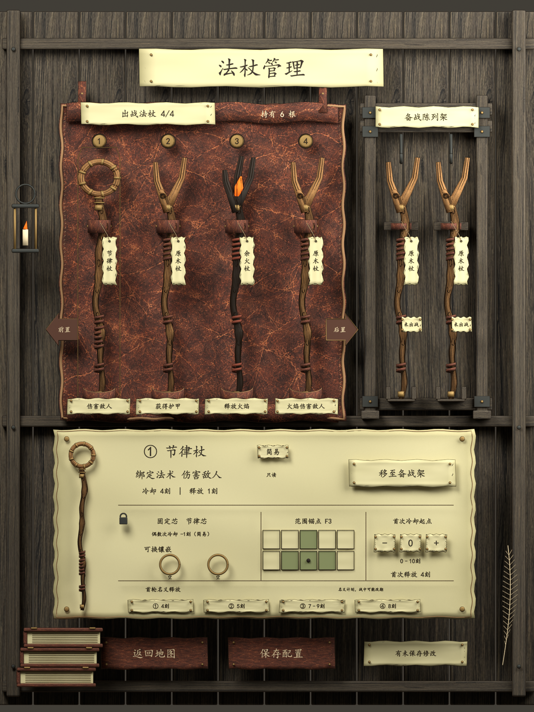

# 法杖管理页面 · 首版原生建模记录

2026-09-14。**NativeAssetsCreated / NeedsArtReview**。用户在整体03及组件细化之后明确“开始建模”，本轮完成左页七组原生资产、总装母版、独立文件、GLB和实际渲染。[交付图册与源文件](../art/wand-management-v01/README.md)是当前入口。

## 制作结果

展开皮袋使用一张连续网格，保留4毫米厚度修改器、大卷边、四个固定环和四个承托杖尾的托位。备战架独立建模、背后开放，组合中与皮革边缘相距约78毫米。法杖分别制作原木叉头、节律空心环头和焦木余烬头，木节、铜箍、皮缠绕可以单独编辑；原木实例复用同型网格。

总装放置四根出战杖和两根备战原木杖；选中节律杖，首轮名义释放为4、5、7–9、8刻。法术信息只读，固定芯与两个可换空槽分开，F3位于下排第三格，亮格为B3/F2/F3/F4。前置／后置、移至备战架、保存／返回仅有美术对象，未连接游戏行为。六根示例不定义起始库存或持有上限。

## 来源与实现方法

造型依据[整体03](../concepts/wand-management-overall-v03.png)和[七组参考稿](../concepts/wand-management-sheets-v01/index.md)，分件依据[建模说明](blender-wand-management-components-v01.md)。功能沿用[2026-09-14 RC1局部快照](../references/design/2026-09-14-wand-management-rc1/manifest.json)，来源提交87840a2；用户本页修订继续优先，不改正式GDD。

本会话没有可调用的电脑控制工具，因此使用本地 Blender 4.5.13 自带 Python/bpy 建模、保存与渲染；本轮没有通过电脑插件操作界面，也没有启用 Blender MCP。输出包含实际网格、曲线、修改器和49个可编辑FONT文字对象；总装正面及斜视均为Cycles渲染，非图像模型效果图。

皮革沿用MD-11生成材质，木架沿用E1暗木纹；另用内置imagegen调整生成一张1254×1254暖木纹，映射在法杖表面。[新纹理来源](../references/wm-native/manifest.json)保留原图位置、输入图和提示词SHA，原始输出按字节复制。羊皮纸沿用已有底纹，中文使用本机楷体并打包进.blend。

## 资产结构与成本

| 组 | 可编辑文字 | 评估后／GLB三角形 |
| --- | ---: | ---: |
| WM-01 展开皮袋 | 0 | 35,336 |
| WM-02 备战架 | 0 | 3,316 |
| WM-03 原木杖 | 0 | 20,112 |
| WM-04 节律杖 | 0 | 23,300 |
| WM-05 余火杖 | 0 | 18,950 |
| WM-06 配置羊皮纸 | 24 | 163,528 |
| WM-07 吊牌与操作件 | 25 | 150,512 |
| 完整页面（含重复杖与杂物） | 49 | 481,414 |

独立根对象归零，源文件中保留可编辑曲线和文字；GLB阶段才转换为网格。独立预览设施不进入交换文件。中文网格和细曲线占用较高，以上仅是原生美术原型成本，尚无LOD或Godot性能结论。

## 验证与视觉检查

[检查记录](../art/wand-management-v01/verification.json)共118项，通过实际重开七个.blend与实际回导七个组件GLB及总装GLB核验。检查包括哈希、原点、几何数、曲线／文字可编辑性、贴图字体打包、连续皮面、固定件数量、袋架间距、六杖分组、两槽／十格／F3四格、只读文字和首轮时间。GLB与原生模型的轴向包围盒偏差在本次检查中为0，三角形数量相同。

已查看正面、斜视和七张分件图。制作中修正了标题及序号被挡、木杆与深木墙接近、纸面过亮、独立导出镜头偏移，以及浅色按钮文字被描边吞没。镜头校正按重新打开后的实际几何取景，同时兼容Blender自动添加的集合名编号；浅色文字单独排除Freestyle描边，仍保留可编辑文字实体。全页和七组组件均加入完整入镜检查。

原E1 R2、右侧桌面v02与MD-11母版的制作前后SHA一致；E1 R2文件在本轮开始前已有未提交修改，本轮没有覆盖或纳入提交。

[交付文件检查](../art/wand-management-v01/delivery-checks.json)另核对文稿链接、四份生产脚本语法、当前交付哈希与暖木纹原始输出复制。入口PowerShell脚本已通过语法解析。

## 当前限制与下一步

这是一版可编辑的3D美术原型，尚未达到已通过绘画稿的细节密度。木杆排线偏规整、皮革裂纹密度偏均匀、架体接头和余烬头偏简化；需要结合总装视角继续雕刻轮廓、分布磨损和调整材质。当前绘画稿继续作为目标，不能把首版模型简化程度当作最终标准。

纸面当前只有选中出战节律杖这一组静态状态，库存换入、镶嵌变化、拖动、保存结果和战中只读行为未实现。GLB固定文字需在运行时替换，Freestyle也需转换为引擎描边方案。未做横屏合页、字号缩放、键盘或玩家理解验证；Godot仍为E1 R2，E2–E4未开始。下一步首先评议这一批实际模型的轮廓、袋架比例和材质，再据反馈细化。
