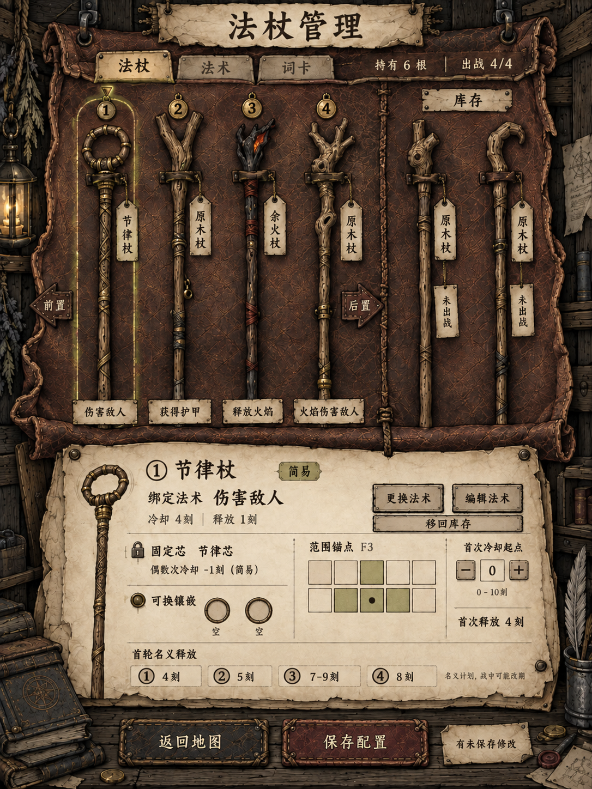

# 左侧页面01 · 法杖管理视觉设计

2026-09-14。状态：**VisualDesignDraft / OverallAwaitingReview**。本轮先做整体生图，尚未制作该页面的Blender模型或Godot交互。

用户原话：“接下来开始左侧页面：第一个页面：‘法杖管理’页面：页面采用展开的法杖袋皮革样式，挂着一根根需要管理的法杖；法杖管理页面所需要素参考全游戏GDD入口；仍然先生图。”

[整体效果图02](../concepts/wand-management-overall-v02.png) · [完整初稿提示词](../concepts/wand-management-overall-v01-prompt.md) · [定点修订提示词](../concepts/wand-management-overall-v02-prompt.md) · [来源清单](../concepts/wand-management-overall-v02-manifest.json)

## 设计依据与状态

功能依据用户指定的[全游戏GDD RC1](E:/Project/game/workspaces/game-002/game-design-workflow/gdd/GDD-2026-09-14-yanzhou-full-game.md)，重点采用[UX02／03／05／07／08](E:/Project/game/workspaces/game-002/game-design-workflow/gdd/yanzhou-rc1/08-journey-ui-and-assets.md)、[WG01／SG01](E:/Project/game/workspaces/game-002/game-design-workflow/gdd/yanzhou-rc1/02-grammar-and-configuration.md)及[PG-T01](E:/Project/game/workspaces/game-002/game-design-workflow/gdd/yanzhou-rc1/06-parameters-and-economy.md)。这些功能规格已Accepted；本文的皮革布局、造型与示例陈列属于待评议视觉方案，不改GDD。

输入固定于主设计仓库提交`87840a221af330a2c715fc9c390eae982a00aebd`；四份相关文档按原字节保存在[局部来源快照](../references/design/2026-09-14-wand-management-rc1/manifest.json)，不替换实验最初的设计快照。源文件中的链接应在原GDD目录解析。

风格沿用已确认[右侧整体05](../concepts/map-desk-overall-v05.png)和[MD-11旧皮长袋设计](../concepts/blender-sheets-v02/md-11-wand-roll-appearance-v01.png)：粗糙整皮、暗红褐色、浅色磨损边、手工针脚和墨线排线。当前原生袋子已制作，但本页生图从已确认的绘画风格出发，不把首版Blender渲染的简化程度当作最终美术上限。

## 页面构成

一张展开的旧皮革挂在木质背景前，边缘保留卷曲与不规则轮廓；多根长杖通过窄皮条固定，杖头向上。它承担页面的大背景和法杖陈列区。下方别着一张配置羊皮纸，页脚用有明确文字的皮革／纸签按钮承载返回和保存。

| 区域 | 本图表达 | GDD依据／边界 |
| --- | --- | --- |
| 标题与导航 | 法杖管理；法杖、法术、词卡入口 | UX02–03三步编排可互通，本页聚焦法杖 |
| 库存与出战 | “持有6根”和“出战4/4”分开，四根出战与两根备用实物分组 | SG01最多4出战，持有数量不另设总容量；不能写成6/6库存 |
| 实物识别 | 公开出战序号、同型不同实体、原木／节律／余火三种轮廓 | WG01、UX08；不同造型不新增效果或稀有度 |
| 绑定法术 | 各杖下方悬挂完整法术短名；选中详情给类型、冷却C／释放L、更换／编辑入口 | UX03；不把每个词当一条独立法术 |
| 镶嵌 | 不可拆固定芯与两个可换空槽分栏 | WG01／BR06；固定芯不是第三个可换槽 |
| 范围锚点 | 所选杖的2×5示意，F3锚点；节律十字裁成四格 | WG01；棋盘两排，锚点可选全部10格，不需空位 |
| 顺序与起点 | 前置／后置、首次冷却起点−／＋、0–10刻范围 | UX03；起点不是释放时刻，开战后不可编辑 |
| 时间摘要 | 只展示首轮名义释放4、5、7–9、8刻，明确名义计划 | PG-T01、UX03；不是完整战斗预测 |
| 页脚 | 返回地图、保存配置、未保存状态 | UX05；离开未保存页的保存／放弃流程留在后续状态设计 |

页面按左侧独立页生成纵向构图，不是把最终游戏改为竖屏。未来合屏仍按GDD的1280×720至1920×1080横屏、字号100／125／150%验证；本图不能证明缩放与操作可读性已经通过。

## 示例库存与实际数值

本图采用中后期已购买节律和余火各一根的陈列样本，总共保有起始四根原木＋两根购入杖。两根新杖分别替换一个出战位，原木保留在库存；这是可经不同商店取得的视觉示例，不声称开局赠送六根或同店出售两根法杖。没有绘制未经来源支持的金币余额。

| 出战序号 | 法杖 | 完整法术 | C／L | 首次冷却起点 | 首轮名义释放 |
| --- | --- | --- | --- | --- | --- |
| ①，选中 | 节律杖 | 伤害／敌人 | 4／1 | 0 | 4刻 |
| ② | 原木杖 | 获得／护甲 | 4／1 | 1 | 5刻 |
| ③ | 余火杖 | 释放／火焰 | 5／3 | 2 | 7、8、9刻 |
| ④ | 原木杖 | 火焰／伤害／敌人 | 6／1 | 2 | 8刻 |

四句沿UX默认实体分配，共用实际起始库存中的9张，不额外赠词；两个可换槽在本图留空。选中节律杖第一周期不缩冷却；第二正常周期5刻开始、8刻释放时会与④竞争开始槽，后杖④覆盖①。③在8刻的持续处理不因④开始就整段取消。完整循环／冲突示意属于后续时间轴状态设计，本图仅列首轮。

选中杖锚点F3，正确范围为F2/F3/F4/B3：图示上排只亮中间一格，下排亮中间三格，其他六格不亮。原木对应两排三列，余火对应锚点所在行三格，不能把三杖范围统一成同一个十字。

## 后续状态与本轮边界

后续功能稿还须覆盖换杖后退库及镶嵌卸回、可换镶嵌库存／激活／互斥、实例失效提示、当前未出现的条件目标、原范围与借位后目标范围、完整名义冲突、空库存、未保存离开与保存失败、战中只读、键盘聚焦与点击替代拖动。各项已有GDD规则，不重新编玩法。本页未进入战斗准备，因此不加“开战”按钮。

不添加出售、分解、强化、修理、耐久、负重或颜色稀有度等GDD以外机制。皮革中的可见挂位是陈列，不能推导库存上限；六根造型是示例，不要求立刻追加六个原生资产。

本轮只产出整体效果图和设计文稿。右侧原生组合仍为MD-11制作提交`8a1d614`，Godot仍为E1 R2，未修改模型或运行场景。下一步先评议展开皮革、法杖悬挂和信息密度，再据方向细化组件设计。

## 实际图像检查

内置imagegen先生成1086×1448整体01，再定点补上“移回库存”按钮，得到同尺寸整体02，当前选用02。两张原图均按字节复制，提示词与SHA留档，未插值放大或后期拼字。

已查看最终图：六根悬挂实物、四个出战序号、两根未出战标签和分开的数量状态可见；下方同一选中杖的缩略示意不计为第七根库存。固定芯与两个空槽、正确四格十字范围、冷却4／释放1、起点0与首放4均已呈现。更换／编辑法术、移回库存、顺序、保存和返回入口可见。细小文字、键盘路径和720p合屏仍须在真实布局中验证，生成图不作为交互已实现的证据。
